# Design Document — Project RKW (Kart Rental Game)

## Visão Geral (Overview)

Este documento detalha a arquitetura técnica, componentes, modelos de dados, fluxos e estratégias de teste para o jogo mobile **Project RKW** (codinome interno) — um jogo multiplayer de kart rental com dirigibilidade simcade autêntica, publicado para Android e iOS a partir de uma base Unity 6.3 LTS (`6000.3.22f1`).

> ⚠️ "Rental Kart World" NÃO é nome aprovado. Usar codinome "Project RKW" internamente. Bundle ID é placeholder provisório.

### Decisões Arquiteturais Fundamentais

| Decisão | Escolha | Justificativa |
|---|---|---|
| Engine | Unity 6.3 LTS (`6000.3.22f1`) | Mobile-first, ecossistema maduro, C# |
| Render Pipeline | URP | Otimizado para mobile |
| Física | PhysX (Rigidbody) + Custom C# Kart Dynamics | Colisões PhysX + dinâmica autêntica |
| Multiplayer | Photon Fusion 2 (Shared Mode → migração server authority) | Menor latência para BR (região a confirmar), SDK maduro, caminho de migração |
| Backend | Unity Gaming Services (UGS) | All-in-one, zero infra, serverless |
| CI/CD | Unity Build Automation | iOS sem Mac local, integração nativa |
| Identificador | `br.com.suitedigital.rentalkartworld` (**PROVISÓRIO**) | Estável por ambiente (.dev, .staging, prod) — NÃO definitivo |

### Princípios de Design

1. **Client fornece dados; backend valida plausibilidade** — em Shared Mode, client FORNECE resultados; backend verifica plausibilidade e pode rejeitar dados implausíveis; resultados de Shared Mode são NÃO-OFICIAIS. Economia e progressão são server-authoritative.
2. **Parâmetros são dados, não código** — ScriptableObjects e Remote Config.
3. **Reprodutibilidade aproximada** — Fixed Timestep + tolerâncias; PhysX NÃO garante determinismo mesmo na mesma plataforma; ghost usa amostras gravadas.
4. **Monetização ética** — sem pay-to-win, sem loot boxes pagas, zero impacto em gameplay.
5. **Pistas fictícias** no MVP — sem uso de marcas reais sem autorização.
6. **Shared Mode = autoridade distribuída** — cada cliente tem autoridade sobre seu próprio estado; anti-cheat limitado até migração para server authority.
7. **SessionContextKey / LeaderboardKey** — tempos de contextos competitivos diferentes NUNCA se misturam em rankings.
8. **Arquitetura preparada, MVP limitado** — preparar extensões sem implementá-las prematuramente.

---

## Arquitetura

### Diagrama de Alto Nível

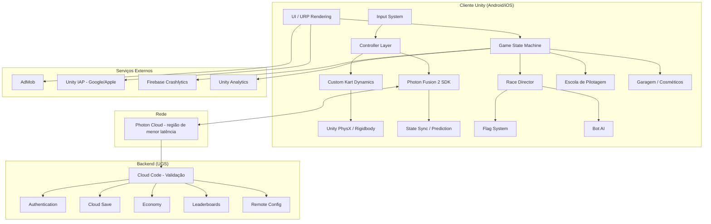

### Organização de Assemblies

```
Assemblies/
├── RKW.Core.asmdef              # Tipos compartilhados, interfaces, enums, constantes
├── RKW.Physics.asmdef           # Camada custom de dinâmica de kart
├── RKW.Physics.Tests.asmdef     # Testes EditMode de física
├── RKW.Race.asmdef              # Race Director, flags, penalidades, checkpoints, timing, sectors
├── RKW.Race.Tests.asmdef        # Testes de regras e corrida
├── RKW.Timing.asmdef            # Cronometragem, setores, delta, ideal lap, rankings
├── RKW.Timing.Tests.asmdef      # Testes de timing e rankings
├── RKW.Bots.asmdef              # IA dos bots (waypoints, perfis, decisões)
├── RKW.Bots.Tests.asmdef        # Testes de bots
├── RKW.Network.asmdef           # Abstração Photon Fusion, sync, prediction
├── RKW.Network.Tests.asmdef     # Testes de rede
├── RKW.Backend.asmdef           # Integração UGS (Auth, Cloud Save, Economy, etc.)
├── RKW.Backend.Tests.asmdef     # Testes de backend
├── RKW.UI.asmdef                # UI, menus, HUD, garagem, interface modes
├── RKW.Controls.asmdef          # Input handling, layout, assistências
├── RKW.School.asmdef            # Escola de pilotagem (módulos, progressão, instrutor)
├── RKW.Telemetry.asmdef         # Analytics, eventos, telemetria, ghost recording
├── RKW.Track.asmdef             # TrackConfiguration, EnvironmentPreset, TrackCondition
├── RKW.Track.Tests.asmdef       # Testes de configuração de pista
├── RKW.Championship.asmdef      # Campeonato privado, scoring, desafios
├── RKW.Championship.Tests.asmdef # Testes de campeonato
├── RKW.PlayMode.Tests.asmdef    # Testes PlayMode integrados
└── RKW.Editor.asmdef            # Ferramentas de editor, inspectors custom
```

**Rationale:** Assemblies separados garantem compilação incremental rápida, isolamento de dependências e testabilidade. `RKW.Physics` não referencia `RKW.Network` — a camada de rede consome Physics via interface.

---

## Modelo de Cenas (Scene Model)

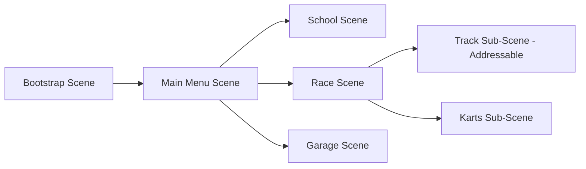

| Cena | Carregamento | Conteúdo |
|---|---|---|
| `Bootstrap` | Sempre presente | Inicialização, auth, remote config, DI container |
| `MainMenu` | Additive após bootstrap | UI principal, lobby, matchmaking |
| `Race` | Substitui menu | Race Director, HUD, gameplay core |
| `Track_*` | Addressable additive | Geometria da pista, colliders, waypoints, iluminação |
| `School` | Substitui menu | Módulos da escola, exercícios |
| `Garage` | Additive sobre menu | Visualização de kart, cosméticos |

**Addressables:** Pistas são baixadas sob demanda. O pacote base contém apenas a pista do MVP. Pistas futuras (incluindo parceiros reais pós-MVP) são distribuídas via Addressables.

---

## Fluxo de Corrida (Race Flow)

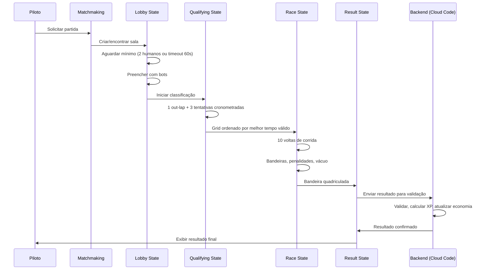

---

## Máquina de Estados da Corrida (Race State Machine)

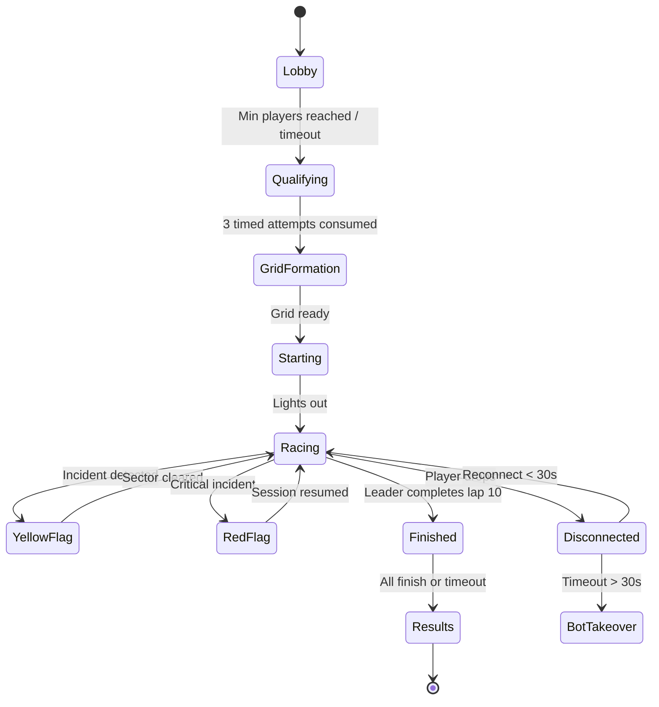

| Estado | Duração | Ações |
|---|---|---|
| `Lobby` | 30–60 s | Matchmaking, bots fill, countdown |
| `Qualifying` | ~90 s (1 out-lap + 3 tentativas) | Tomada de tempo individual; voltas inválidas consomem tentativa |
| `GridFormation` | 5 s | Animação de grid |
| `Starting` | 3–5 s | Semáforo (luzes configuráveis por Ruleset/StartProcedure — hipótese: 5) |
| `Racing` | ~5 min (10 voltas) | Gameplay principal; líder VENCE ao completar 10ª volta |
| `Finished` | Até 60s timeout (configurável via Remote Config) | Demais recebem quadriculada ao cruzar linha; stragglers classificados por voltas(desc)+tempo(asc) |
| `Results` | 15 s | Exibe resultado + envia backend |

---

## Sistema de Física (Physics System)

### Arquitetura PhysX + Custom Layer

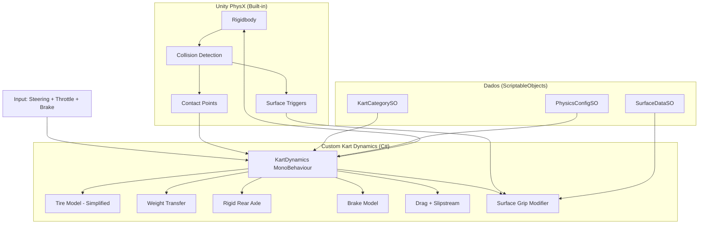

### Responsabilidades

| Camada | Responsabilidade |
|---|---|
| **Unity PhysX** | Integração temporal (FixedUpdate), detecção de colisão, contact points, triggers de superfície, gravity |
| **Custom C# Layer** | Forças longitudinais/laterais, modelo de pneu simplificado, transferência de peso, eixo traseiro rígido, lift-off interno, drag/slipstream, grip por superfície |
| **ScriptableObjects** | Parâmetros por categoria (HP, velocidade máx, aderência, etc.), dados de superfície, constantes de calibração |

### Modelo de Pneu Simplificado

```
Aderência = f(slip_angle) * grip_superfície * peso_sobre_pneu
```

- Curva de aderência: pico seguido de queda progressiva (não abrupta).
- Sem temperatura/desgaste no MVP.
- Slip angle calculado entre heading do pneu e direção de movimento.

### Eixo Traseiro Rígido

- Ambas as rodas traseiras giram na mesma velocidade angular.
- Em curva, a roda interna precisa "aliviar" via transferência de peso.
- Esterço excessivo sem alívio → kart "amarra" → perda de velocidade.
- O custom layer calcula lift-off da roda interna baseado em velocidade, raio de curva e CG height.

### Transferência de Peso

```csharp
// Pseudocódigo simplificado
weightFront = baseWeight * 0.5f + (brakeForce * cgHeight / wheelbase);
weightRear = baseWeight - weightFront;
weightInner = weightRear * 0.5f - (lateralForce * cgHeight / trackWidth);
weightOuter = weightRear - weightInner;
```

### Frenagem

- Distribuição predominantemente traseira (70% rear / 30% front — hipótese).
- Freio em linha reta: distância mais curta.
- Freio com esterço: sobre-esterço progressivo, distância maior.
- Bloqueio de pneu quando força de frenagem > aderência disponível.

### Fixed Timestep e Reprodutibilidade Aproximada

- `Time.fixedDeltaTime = 0.02f` (50 Hz).
- Toda a física custom executa em `FixedUpdate`.
- Reprodutibilidade **aproximada dentro de tolerâncias** na mesma plataforma. PhysX NÃO garante determinismo mesmo no mesmo hardware/OS.
- **Não** prometido cross-platform (diferenças de FPU/arquitetura).
- Ghost baseado em amostras GRAVADAS de posição/rotação, NÃO dependente de re-simulação determinística.
- Testes com tolerância: posição ±0,01 m, velocidade ±0,1 km/h após 1000 ticks.

### Categorias (ScriptableObjects)

| Parâmetro | Escola (6,5 HP) | Rental (9 HP) | Rental Sport (13 HP) | Rental Pro (18 HP) |
|---|---|---|---|---|
| Potência (HP) | 6,5 | 9 | 13 | 18 |
| Vel. máxima (km/h) | 55 | 70 | 85 | 100 |
| Aceleração 0→max (s) | 8,0 | 6,5 | 5,0 | 4,0 |
| Dist. frenagem (m @ max) | 12 | 18 | 25 | 33 |
| Aderência lateral (g) | 1,0 | 1,1 | 1,2 | 1,3 |
| Inércia rotacional | Baixa | Média | Média-Alta | Alta |
| Tolerância a erro | Alta | Média | Baixa | Muito Baixa |
| Sensibilidade ao esterço | Baixa | Média | Alta | Muito Alta |

> ⚠️ Todos os valores são hipóteses de calibração até validação com telemetria e pilotos reais.

---

## Controles (Controls)

### Arquitetura de Input

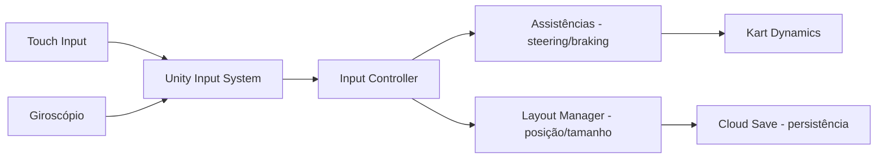

| Componente | Responsabilidade |
|---|---|
| `InputController` | Traduz input raw em steering [-1,1], throttle [0,1], brake [0,1] |
| `AssistanceLayer` | Aplica suavização, anti-spin, assistência de frenagem |
| `LayoutManager` | Gerencia posição/tamanho dos controles na tela |
| `HapticFeedback` | Dispara vibração conforme eventos (zebra, contato, etc.) |

### Modos de Direção
- **Joystick Virtual**: Arraste horizontal, retorna ao centro.
- **Volante Virtual**: Giro rotacional com feedback visual.
- **Inclinação (Tilt)**: Giroscópio com sensibilidade e zona morta configuráveis.

### Acelerador Progressivo
- Rampa temporal: ≥150 ms para full throttle (evita spin na saída).
- Sem dependência de force touch.
- Opção alternativa: gesto vertical (posição do dedo = intensidade).

---

## Bots (AI)

### Arquitetura

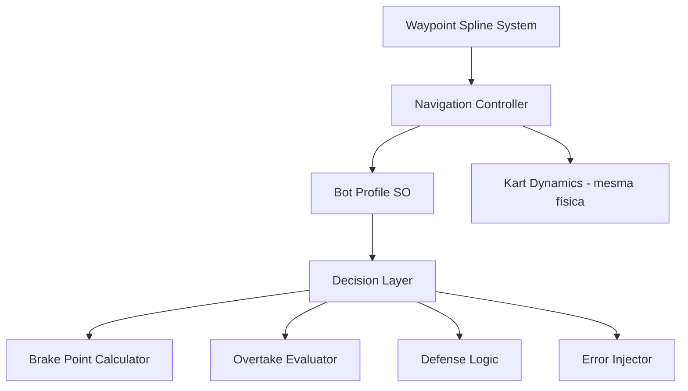

| Componente | Responsabilidade |
|---|---|
| `WaypointSpline` | Define traçado ideal por setor com variação lateral |
| `BotProfileSO` | Parâmetros: consistência, ponto de frenagem, erros, defesa |
| `NavigationController` | Segue spline com variação por perfil |
| `DecisionLayer` | Avalia ultrapassagem, defesa, respeito a flags |
| `ErrorInjector` | Injeta erros humanos parametrizados |

### Performance Budget
- CPU por bot: < 0,5 ms/frame
- 9 bots simultâneos: < 5 ms total
- Memória por bot: < 2 MB

---

## Photon Fusion 2 — Networking

### Modelo de Autoridade (MVP: Shared Mode — Autoridade Distribuída)

> ⚠️ **Shared Mode NÃO é "host authority".** State Authority é DISTRIBUÍDA: cada cliente tem autoridade sobre seu próprio NetworkObject (kart). Não há servidor central validando estado em tempo real.

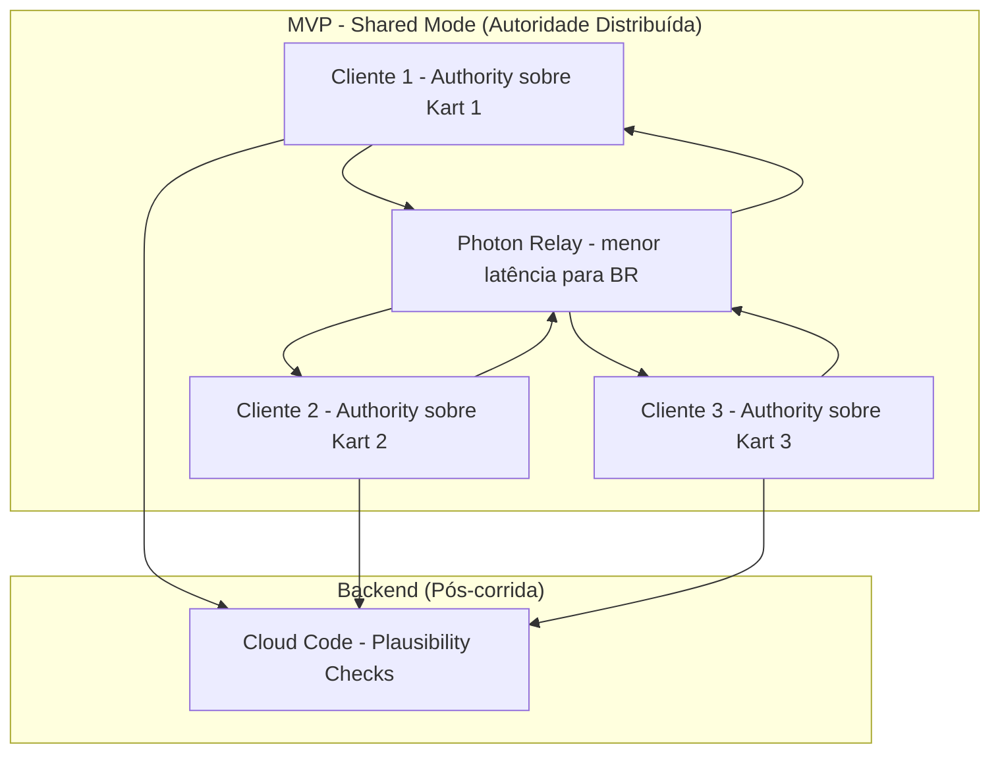

**Como funciona:**
- Cada cliente simula LOCALMENTE e publica o estado de SEU kart.
- Outros clientes recebem o estado e interpolam para exibição.
- Nenhuma entidade central valida estado em tempo real.
- Validação ocorre APÓS a corrida via plausibility checks no backend.

**Limitações Anti-Cheat do Shared Mode (Alpha):**
| Limitação | Impacto | Aceitável até... |
|---|---|---|
| Cliente pode manipular velocidade/posição do próprio kart | Tempo falso, posição injusta | Migração para server authority |
| Sem validação em tempo real de estado | Speedhack possível | Server authority |
| Colisões resolvidas localmente | Inconsistência entre clientes | Server authority |
| Resultados dependem de report do client | Client pode reportar resultado forjado | Backend valida plausibilidade |

**Mitigações no Shared Mode:**
1. Plausibility checks no backend (tempo vs máximo teórico da categoria)
2. Detecção estatística de anomalias pós-corrida
3. Sistema de denúncia social
4. Telemetria mínima obrigatória
5. Rankings marcados como NÃO-OFICIAIS
6. NENHUM prêmio/economia significativa em Shared Mode

### Dados Sincronizados por Tick (30 Hz)

| Dado | Bytes | Método |
|---|---|---|
| Posição (Vector3 quantizado) | 6–12 | Unreliable |
| Rotação (compressed quaternion) | 4 | Unreliable |
| Velocidade (Vector3) | 6–12 | Unreliable |
| Input (steer + throttle + brake) | 3 | Unreliable |
| Estado (flags, penalidades) | 2 | Reliable |

### Bandwidth Estimado
- Por jogador: ~10 KB/s (10 participantes, 30 Hz)
- Aceitável para 4G/LTE brasileiro.

### Caminho de Migração para Server Authority

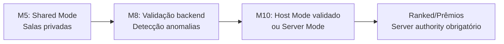

**Gate de migração:** Nenhum dos seguintes será ativado sem server authority:
- Ranked competitivo
- Campeonatos com prêmio
- Resultados oficiais publicados
- Economia significativa baseada em resultados

### Abstraction Layer

```csharp
// Interface para desacoplamento de Photon (Shared Mode compatível)
public interface INetworkTransport
{
    void SendInput(KartInput input);
    void OnStateReceived(KartState state);
    void OnDisconnect(DisconnectReason reason);
    bool HasStateAuthority { get; }  // Photon Fusion Shared Mode: authority sobre o próprio kart
    void OnSessionRecovery(SessionRecoveryReason reason);  // Substituído "host migration"
}
```

Permite migração futura para Mirror, Fish-Net ou custom server sem reescrever lógica de jogo. O conceito de "session recovery" substitui "host migration" em Shared Mode — Photon Fusion gerencia a redistribuição de estado quando um participante desconecta.

---

## Backend (UGS)

### Serviços e Responsabilidades

| Serviço UGS | Uso no Projeto |
|---|---|
| Authentication | Login Google/Apple/Guest → Player ID |
| Cloud Save | Perfil, configurações, progresso escola |
| Economy | Coins, Gems, inventário de cosméticos |
| Leaderboards | Melhor volta por pista/categoria, ranking sazonal |
| Remote Config | Feature flags, parâmetros de regras, preços, LiveOps |
| Cloud Code | Validação de resultados, processamento de IAP, anti-cheat |

### Fluxo de Validação de Resultado

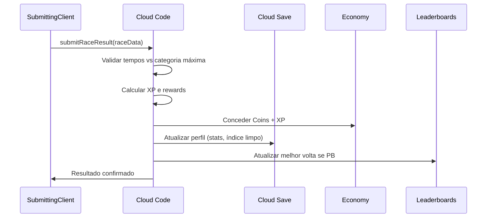

---

## Modelo de Dados (Data Models)

### KartCategorySO (ScriptableObject)

```csharp
[CreateAssetMenu(fileName = "NewCategory", menuName = "RKW/Kart Category")]
public class KartCategorySO : ScriptableObject
{
    [Header("Identificação")]
    public string categoryId;
    public string displayName;
    public float horsePower;
    
    [Header("Performance")]
    public float maxSpeed;          // km/h
    public float acceleration;      // tempo 0→max (s)
    public float brakingDistance;    // metros @ maxSpeed
    
    [Header("Aderência")]
    public float lateralGrip;       // g
    public AnimationCurve tireGripCurve; // aderência vs slip angle
    
    [Header("Dinâmica")]
    public float rotationalInertia;
    public float steeringSensitivity;
    public float errorTolerance;    // quão perdoador é
    
    [Header("Frenagem")]
    public float brakeDistributionRear; // 0-1 (0.7 = 70% traseiro)
    public float lockThreshold;
}
```

### Player Profile (Cloud Save JSON)

```json
{
  "version": 1,
  "playerId": "string",
  "displayName": "string",
  "licenses": { "escola": true, "rental": false, "rentalSport": false, "rentalPro": false },
  "xp": 0,
  "level": 1,
  "cleanDrivingIndex": 80,
  "settings": {
    "controlMode": "joystick",
    "layout": {},
    "haptic": true,
    "assists": { "steering": "light", "braking": "light" }
  },
  "schoolProgress": { "completedModules": [], "currentModule": 1 },
  "stats": { "racesCompleted": 0, "bestLaps": {}, "totalDistance": 0 }
}
```

### Race Result (validado por Cloud Code)

```json
{
  "raceId": "uuid",
  "trackId": "string",
  "trackConfigurationId": "string",
  "sessionContextKey": {
    "trackConfigurationId": "track01_cw",
    "kartCategoryId": "rentalSport",
    "trackConditionId": "dry",
    "environmentPresetId": "day",
    "gameMode": "quickMatch",
    "physicsVersion": 1,
    "trackVersion": 1,
    "rulesetVersion": 1,
    "assistClass": "standardized"
  },
  "leaderboardKey": {
    "trackConfigurationId": "track01_cw",
    "kartCategoryId": "rentalSport",
    "trackConditionId": "dry",
    "environmentPresetId": "day",
    "gameMode": "quickMatch",
    "physicsVersion": 1,
    "trackVersion": 1,
    "rulesetVersion": 1,
    "assistClass": "standardized"
  },
  "category": "rentalSport",
  "timestamp": "ISO8601",
  "players": [
    {
      "playerId": "string",
      "position": 1,
      "bestLapUs": 45230456,
      "totalTimeUs": 480100234,
      "sectorBests": [15100000, 14900000, 15230000],
      "lapsCompleted": 10,
      "penalties": [
        {
          "type": "track_limits",
          "lap": 5,
          "sector": 2,
          "rule": "4_wheels_off",
          "punishmentMs": 3000,
          "origin": "automatic"
        }
      ],
      "xpEarned": 120,
      "cleanDelta": 2,
      "isBot": false,
      "controlType": "joystick",
      "assists": { "steering": "light", "braking": "none" },
      "disconnectEvents": 0,
      "collisionEvents": [{ "severity": 0.3, "lap": 2 }]
    }
  ],
  "validatedBy": "cloudCode",
  "validationType": "plausibility",
  "officialResult": false,
  "serverTimestamp": "ISO8601"
}
```

> ⚠️ `officialResult: false` para todas as sessões em Shared Mode. Rankings são NÃO-OFICIAIS até migração para server authority.

---

## Autenticação e Identidade

### Fluxo de Login

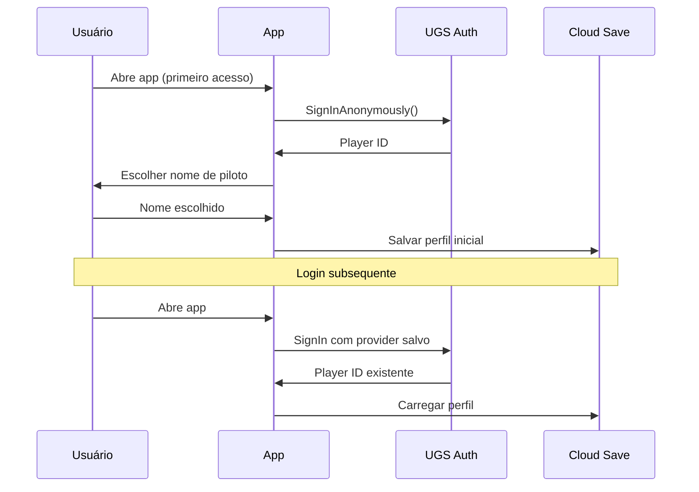

### Providers Suportados
- **Guest (anônimo)**: Primeiro acesso sem fricção.
- **Google Play Games**: Vinculação posterior.
- **Sign in with Apple**: Obrigatório se oferecemos login social (Apple policy).
- **Upgrade de guest**: Player pode vincular conta depois sem perder progresso.

---

## Economia (Economy)

### Moedas

| Moeda | Tipo | Fonte | Uso | Server-Authoritative |
|---|---|---|---|---|
| Coins | Virtual (grátis) | Corridas, escola, ads recompensados, nível | Cosméticos básicos | ✅ |
| Gems | Virtual (premium) | IAP | Cosméticos premium, passe | ✅ |

### Invariante Fundamental
```
∀ transação: saldo_resultante ≥ 0
```

O client **nunca** modifica moeda diretamente. Toda operação passa por Cloud Code.

### Guardrails de Inflação
- Sink/source ratio alvo: 0,8–1,2
- Monitoramento semanal via telemetria
- Ajuste via Remote Config se ratio > 1,5 por 7 dias

---

## Telemetria e Analytics

### Stack

| Serviço | Responsabilidade |
|---|---|
| Unity Analytics | Eventos in-game, funis, retenção |
| Firebase Crashlytics | Crash reporting, ANRs |
| UGS Remote Config | Segmentação, A/B testing |
| Cloud Code | Métricas de economia, validação |

### Eventos Críticos MVP

| Evento | Propósito |
|---|---|
| `race_completed` | Engajamento core |
| `lap_completed` | Análise de consistência |
| `penalty_applied` | Calibração de regras |
| `iap_completed` | Receita |
| `fps_sample` | Saúde de performance |
| `tutorial_completed` | Conversão escola |
| `disconnect` | Qualidade de rede |

### Privacidade
- Sem PII direta em eventos de analytics; Player IDs são pseudonimizados (podem ser vinculados a uma conta — não são dados anônimos irreversíveis).
- No primeiro boot, o sistema deve apresentar aviso de privacidade claro. Consentimento explícito será solicitado somente para as finalidades cuja base legal aplicável seja consentimento, conforme definição jurídica.
- Opt-out disponível nas configurações para finalidades baseadas em consentimento.
- Crianças < 13: ads personalizados desabilitados, analytics limitados.
- Solicitações de exclusão de dados devem ser processadas respeitando obrigações legais, prevenção de fraude e hipóteses legítimas de retenção definidas por revisão jurídica.

---

## Segurança

### Princípios
1. Em Shared Mode, client FORNECE dados de resultado; backend valida plausibilidade e pode rejeitar. Economia, inventário e progressão são server-authoritative SEMPRE.
2. IL2CPP + code stripping para obfuscação.
3. OAuth providers (sem senha própria).
4. Rate limiting no backend.
5. Validação estatística de anomalias pós-corrida.
6. Rankings marcados como NÃO-OFICIAIS em Shared Mode.

### Anti-Cheat por Camada

| Camada | Proteção |
|---|---|
| Transport | Photon transporta estado (Shared Mode: sem validação autoritativa em tempo real) |
| Runtime | IL2CPP + strip + integrity hash |
| Economy | Backend-only operations |
| Results | Cloud Code plausibility checks (pós-corrida) |
| Statistical | Outlier detection pós-corrida |
| Social | Report system + revisão manual (campeonatos) |

### Modelo de Ameaças MVP

| Ameaça | Mitigação |
|---|---|
| Speed hack | Detecção de anomalias pós-corrida; plausibility check no backend; ranking NÃO-OFICIAL em Shared Mode |
| Teleport | Detecção de anomalias pós-corrida; resultado pode ser rejeitado por plausibility check |
| Economy exploit | Client nunca modifica moeda |
| Resultado falso | Backend valida com telemetria |
| Account takeover | OAuth providers, sem senha |

---

## CI/CD e Build

### Pipeline

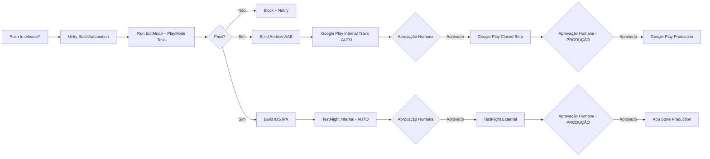

### Identificadores por Ambiente

| Ambiente | Android Package | iOS Bundle ID | Uso |
|---|---|---|---|
| Development | `br.com.suitedigital.rentalkartworld.dev` | `br.com.suitedigital.rentalkartworld.dev` | Dev/debug local |
| Staging | `br.com.suitedigital.rentalkartworld.staging` | `br.com.suitedigital.rentalkartworld.staging` | Testes internos |
| Production | `br.com.suitedigital.rentalkartworld` | `br.com.suitedigital.rentalkartworld` | Loja pública |

### Configuração Técnica

| Parâmetro | Valor |
|---|---|
| Unity Version | 6.3 LTS (`6000.3.22f1`) |
| Scripting Backend | IL2CPP |
| Min API Android | 26 (8.0) |
| Min iOS | 15.0 |
| Architecture Android | arm64-v8a + armeabi-v7a |
| Architecture iOS | arm64 |
| Build Trigger | Push to `release/*` ou `main` |

---

## Android e iOS — Configuração de Plataforma

### Android Específico
- Play App Signing (Google gerencia keystore).
- Proguard/R8 habilitado.
- AAB obrigatório (não APK).
- Target API: 34+ (conforme exigência do Play Console).

### iOS Específico
- Automatic signing via Apple Developer account.
- Bitcode disabled (deprecated).
- Capabilities: In-App Purchase, Push Notifications, Game Center.
- Sign in with Apple obrigatório (Apple policy para apps com login social).

### Feature Flags e Rollback
- Remote Config (UGS) para enable/disable features.
- Staged rollout em ambas as plataformas.
- Force Update para bugs críticos.
- Kill Switch para desabilitar multiplayer se instabilidade.

---

## Performance Budgets

### Por Tier de Dispositivo

| Parâmetro | Baixo | Médio | Alto |
|---|---|---|---|
| FPS alvo | 30 estável | 60 estável | 60 estável |
| Draw calls/frame | ≤ 100 | ≤ 200 | ≤ 350 |
| Triângulos/frame | ≤ 100 K | ≤ 300 K | ≤ 500 K |
| RAM total app | ≤ 512 MB | ≤ 1 GB | ≤ 1,5 GB |
| CPU frame budget | ≤ 33 ms | ≤ 16 ms | ≤ 16 ms |
| Download base | ≤ 150 MB | ≤ 150 MB | ≤ 150 MB |

### Subsistema de Física
- Física custom: < 3 ms/frame total (inclui 10 karts).
- Bot AI (9 bots): < 5 ms/frame total.
- Rede (sync): < 1 ms/frame.

### Auto-Adjust de Qualidade (Correction 7)
- WHEN FPS médio em JANELA de 3s < 28 → reduzir qualidade em 1 nível.
- Upgrade: média 10s > 55 FPS E cooldown 30s E histerese (margem 5 FPS acima do threshold de downgrade).
- Dynamic resolution scale: 70%–100%.
- Thermal Status API: categorias (nominal/light/moderate/severe/critical), não temperatura exata.

### Colisões e Recuperação

**Severidade de Colisão: Escala CONTÍNUA (não binária)**

```
severidade = f(velocidade_relativa_impacto, ângulo, massa)
perda_velocidade = severidade * fator_por_categoria
```

- Toda colisão resulta em perda de velocidade proporcional à severidade.
- Colisões fortes NÃO acionam recuperação automática.
- Penalidade é avaliada pela Direção de Prova (não por threshold binário).

**Recuperação Segura — Condições EXCLUSIVAS:**
1. Kart preso/imóvel > N segundos (hipótese: 4s)
2. Kart invertido > M graus (hipótese: 85°)
3. Kart fora do perímetro recuperável
4. Kart criando risco de segurança

> ❌ Colisão por si só NUNCA aciona recuperação, independente da severidade.

---

## Tratamento de Erros (Error Handling)

### Cenários de Falha e Recuperação

| Cenário | Detecção | Recuperação |
|---|---|---|
| Perda de conexão < 5s | Timeout de heartbeat | Predição local; reconcilia ao reconectar |
| Perda de conexão 5–30s | Timeout estendido | Bot assume; piloto retoma ao reconectar |
| Perda de conexão > 30s | Server timeout | Resultado parcial; posição no momento da queda |
| Session recovery | Participant disconnects | Photon redistribui estado; resync |
| Cloud Save offline | Network check fails | Persistir local; sync ao reconectar (LWW para settings; server-wins para economia) |
| Receipt IAP inválido | Backend validation | Rejeitar; logar para investigação |
| Crash durante corrida | Crashlytics | Ao reabrir: oferecer rejoin se sessão ainda ativa |
| Kart preso (imóvel > 4s) | Position monitoring | Recuperação segura + penalidade |
| Kart voando (altura > 2m) | Height check | Reset de posição |
| Kart invertido (ângulo > 90°) | Orientation check | Reset automático |
| FPS extremamente baixo | Frame timing | Auto-adjust qualidade |
| Memória crítica | System warning | Liberar caches; reduzir qualidade |

### Estratégia de Retry

| Operação | Max Retries | Backoff | Fallback |
|---|---|---|---|
| Auth | 3 | Exponential (1s, 2s, 4s) | Modo offline |
| Cloud Save read | 3 | Linear (1s) | Cache local |
| Cloud Code call | 2 | Exponential (2s, 4s) | Queue para retry posterior |
| Matchmaking | Timeout 60s | N/A | Criar sala com bots |
| IAP validation | 3 | Exponential | Queue; reconcilia depois |

---

## Estratégia de Testes (Testing Strategy)

### Abordagem Dual: Unit Tests + Property-Based Tests

Este projeto emprega uma abordagem dual:
- **Unit tests (EditMode/PlayMode)**: Exemplos específicos, edge cases, integração.
- **Property-based tests**: Propriedades universais que devem valer para todas as entradas válidas.

### Framework de PBT
- **Baseline validado:** NUnit com geradores determinísticos próprios, seed registrada e pelo menos 100 casos por propriedade. FsCheck permanece candidato para reavaliação, sem incorporação até comprovar compatibilidade com Unity Test Framework e IL2CPP.
- **Mínimo:** 100 iterações por property test.
- **Tag format:** `Feature: kart-rental-game, Property {N}: {texto}`

### Pirâmide de Testes

| Nível | Ferramenta | Cobertura |
|---|---|---|
| EditMode (lógica pura) | NUnit + geradores determinísticos próprios | Física, economia, regras, serialização |
| PlayMode (integração) | Unity Test Framework | Fluxos de corrida, checkpoints, bots |
| Network simulation | Photon + Clumsy | Latência, jitter, perda |
| Device testing | Dispositivos reais + Firebase Test Lab | Performance, bateria, temperatura |
| Human testing | Pilotos reais | Dirigibilidade, NPS, calibração |

### Testes de Física com Tolerância
- Mesma seed + inputs → mesma saída (±tolerância definida).
- Tolerância: posição ±0,01 m, velocidade ±0,1 km/h após 1000 ticks.
- Regressão: comparar tempos de baseline após mudanças de calibração.

### Testes de Serialização
- **Round-trip obrigatório**: `deserialize(serialize(x)) == x` para todo dado persistido.
- Profile, settings, race result, ghost data.

### Testes Anti-Cheat
- Injetar velocidade > máx → verificar rejeição.
- Injetar salto de posição → verificar correção.
- Client tenta incrementar moeda → backend rejeita.

---

## Diagramas de Sequência Adicionais

### Escola de Pilotagem — Fluxo de Módulo

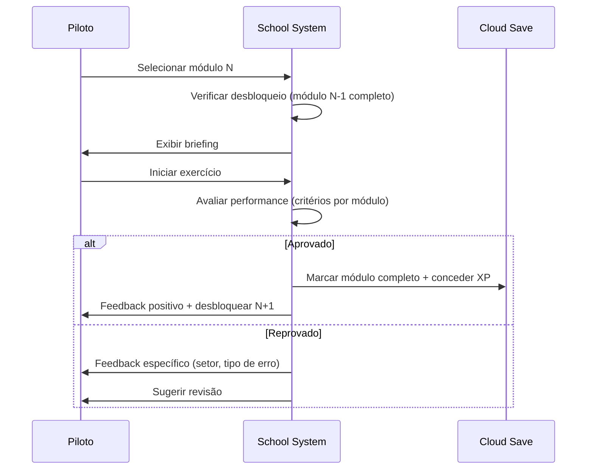

### Fluxo de Compra (IAP)

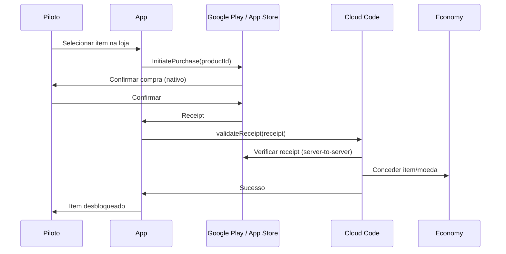

---

## Evolução Pós-MVP (Post-MVP Evolution Path)

### Roadmap de Evolução

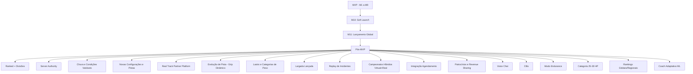

### Real Track Partner Platform (Decisão Aprovada #3 — Pós-MVP)

Plataforma para permitir kartódromos reais terem versões oficiais de suas pistas no jogo.

**Pipeline previsto:**

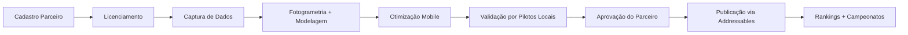

**Escopo completo (não implementado no MVP):**
- Cadastro de kartódromo parceiro
- Licenciamento de nome, marca, layout, imagens, patrocinadores
- Recebimento de fotos autorizadas, vídeos onboard, imagens 360, plantas, medições, GPS, drone
- Pipeline de fotogrametria e modelagem 3D
- Otimização de cena para mobile
- Validação de layout por pilotos locais
- Aprovação final pelo parceiro
- Download via Addressables
- Packs regionais
- Rankings por pista real
- Campeonatos virtuais e presenciais
- Desafios baseados em tempos reais
- Links para agendamento de sessões
- Patrocínios virtuais e placas
- Telemetria comercial para parceiro
- Modelo de revenue sharing

**Restrição:** Iniciar em Brasília, expandir para outros estados/países.

---

## Matriz de Rastreabilidade

| Requisito | Componente | Teste | Telemetria | Fase |
|---|---|---|---|---|
| R1 (Corrida) | RaceDirector, StateMachine | PlayMode: fluxo completo | `race_completed`, `lap_completed` | MVP |
| R2 (Modos) | GameModeManager | PlayMode: cada modo | `race_started` (mode) | MVP |
| R3 (Controles) | InputController, LayoutManager | Unit: sensibilidade; PlayMode: layout | `control_mode_set` | MVP |
| R4 (Física) | KartDynamics, TireModel, WeightTransfer | EditMode: property tests; PlayMode: circuit | `physics_version` | MVP |
| R5 (Categorias) | KartCategorySO | Unit: parâmetros carregados | N/A | MVP |
| R6 (Escola) | SchoolManager, ModuleController | PlayMode: conclusão de módulo | `tutorial_completed` | MVP |
| R7 (Bandeiras) | FlagSystem, PenaltyEngine, RaceDirector | Unit: lógica de flags; PlayMode: cenários | `penalty_applied` | MVP |
| R8 (Bots) | BotNavigator, BotProfile, ErrorInjector | PlayMode: bot completa volta | bot_lap_time | MVP |
| R9 (Multiplayer) | NetworkTransport, PhotonIntegration | Network sim: latência/jitter | `latency_sample`, `disconnect` | MVP |
| R10 (Progressão) | XPCalculator, LicenseManager, CleanIndex | Unit: property tests economia | `currency_earned` | MVP |
| R11 (Monetização) | StoreManager, IAPValidator | Unit: receipt validation | `iap_completed`, `ad_impression` | MVP |
| R12 (Performance) | QualityManager, AutoAdjust | Device testing | `fps_sample`, `quality_downgrade` | MVP |
| R13 (Analytics) | TelemetryManager | Integration: eventos enviados | Todos | MVP |
| R14 (Build) | CI/CD pipeline | Build automation test | build_success_rate | MVP |
| R15 (Telemetria) | TelemetryRecorder | Integration: dados persistidos | `telemetry_record` | MVP |
| R16 (Track Config) | TrackConfigurationSO, TrackLoader | Unit: SO validation; PlayMode: config load | `track_config_loaded` | MVP (arch) |
| R17 (Env Presets) | EnvironmentPresetSO, PresetManager | PlayMode: preset switch | `preset_applied` | MVP (arch) |
| R18 (Conditions) | TrackConditionSO, GripModifier | EditMode: property test grip | `condition_active` | MVP (arch) |
| R19 (Session Key) | SessionContextKey, LeaderboardKey | EditMode: property tests equality | N/A | MVP |
| R20 (Timing) | TimingManager, LapRecord, SectorRecord | EditMode+PlayMode: timing accuracy | `lap_completed`, `sector_time` | MVP |
| R21 (Sector Comp) | DeltaCalculator, SectorHUD | Unit: delta calc; PlayMode: display | `sector_delta` | MVP |
| R22 (Ideal Lap) | IdealLapCalculator | EditMode: property test | `ideal_lap_calculated` | MVP |
| R23 (Rankings) | RankingService, RankingWindow | Unit+Integration: query correctness | `ranking_updated` | MVP (basic) |
| R24 (Ghost) | GhostRecorder, GhostPlayer | PlayMode: ghost replay | `ghost_recorded` | MVP (personal) |
| R25 (Championship) | ChampionshipManager, ScoringEngine | EditMode: scoring property test | `championship_stage` | MVP (basic) |
| R26 (Consistency) | ConsistencyCalculator | EditMode: property test | `consistency_calculated` | MVP (basic) |
| R27 (Notebook) | PilotNotebook | Integration: data persistence | N/A | MVP (simple) |
| R28 (Instructor) | DrivingInstructor, InstructorRules | Unit: cooldown/priority; PlayMode: messages | `instructor_message` | MVP (text) |
| R29 (Challenges) | ChallengeSystem, ChallengeTemplate | Unit+Integration: completion | `challenge_completed` | Alpha/Beta (rotação); MVP: onboarding estático opcional |
| R30 (Card) | ShareableCardGenerator | Integration: image gen | `card_shared` | Alpha/Beta |
| R31 (Race Dir) | PenaltyRecorder, ExplainableUI | Unit: metadata completeness | `penalty_explained` | MVP |
| R32 (Track Evol) | Documentação de extension points (sem código) | N/A | N/A | Pós-MVP |
| R33 (Ballast) | N/A (roadmap only) | N/A | N/A | Pós-MVP |
| R34 (Start Proc) | StartProcedure, LightsSequence | PlayMode: start sequence | `race_started` | MVP |
| R35 (Interface) | HUDManager, InterfaceMode | PlayMode: mode switch | `hud_mode` | MVP |
| R36 (Post-MVP) | N/A (documentation) | N/A | N/A | Pós-MVP |

---

## Riscos Técnicos Identificados

| Risco | Probabilidade | Impacto | Mitigação | Reversível? |
|---|---|---|---|---|
| Custom physics layer não alcança "feel" autêntico | Média | Alto | Iteração contínua + NPS pilotos; ScriptableObjects permitem ajuste sem rebuild | Sim (parâmetros) |
| PhysX colisões imprecisas a 50 Hz | Baixa | Médio | Testar 100 Hz se necessário; ajustar collision matrix | Sim |
| Shared Mode permite cheating em casual | Média | Baixo (MVP) | Aceitável entre amigos; validação backend mitiga | Sim (migra para server) |
| Migração para Server Mode é complexa | Média | Alto | Abstraction layer desde M2; migração planejada para M10 | Parcialmente |
| Photon Fusion 2 EoL ou breaking changes | Baixa | Crítico | Abstraction layer; plano de saída para Mirror | Parcialmente |
| UGS pricing escala acima do budget | Baixa | Alto | Monitorar; plano de migração para Firebase | Sim (com esforço) |
| Performance em Android modesto insuficiente | Média | Alto | Profiling desde M2; 3 quality tiers; dynamic resolution | Sim |
| Calibração de física leva mais tempo que estimado | Alta | Médio | Iniciar calibração em M2; iteração contínua | Sim |
| IL2CPP insuficiente contra cheats sofisticados | Média | Médio | Aceitável no MVP; server authority para ranked resolve | Sim |
| 150 MB de download é grande para Brasil | Baixa | Médio | Addressables; assets on-demand; APK ≤ 150 MB | Sim |

---

## Protótipos Necessários

| Protótipo | Milestone | Objetivo | Validação |
|---|---|---|---|
| Kart dirigível em pista cinza | M2 | Validar feel da física custom | Feedback de pilotos: "parece kart?" |
| Controles touch (3 modos) | M2 | Validar usabilidade sem auto-acelerador | Sessão com não-pilotos: completam volta? |
| Networking 4 jogadores | M5 | Validar sync a 30 Hz com latência real | Sessão remota BR: sem teleporte visível? |
| Bots com 5 perfis | M4 | Validar que bots parecem humanos | Pilotos não distinguem bot de humano? |
| Auto-adjust qualidade | M3 | Validar FPS sustentado em Android modesto | 30 FPS por 30 min sem throttling? |

---

## Decisões Reversíveis vs Irreversíveis

### Reversíveis (baixo custo de mudança)
- Parâmetros de física (ScriptableObjects)
- Tick rate (30 Hz → 60 Hz: config change)
- Regras de penalidade (Remote Config)
- Preços de cosméticos (Remote Config)
- Layout de controles
- Perfis de qualidade gráfica
- Parâmetros de matchmaking
- Duração de passe de temporada

### Difíceis de Reverter (requerem planejamento)
- Bundle ID (`br.com.suitedigital.rentalkartworld`) — **PROVISÓRIO; pendente verificação de marca e decisão do fundador. NÃO registrar apps definitivos nas lojas antes de decisão.**
- Modelo de autoridade de rede (Shared → Server requer refactor)
- Backend provider (UGS → Firebase requer migração 2–4 semanas)
- Engine (Unity → Godot: improvável, mas plano de saída existe)
- Estrutura de Cloud Save schema (migração de dados existentes)

### Trabalho que Requer Validação Humana (🧑‍💻)

| Item | Responsável | Quando |
|---|---|---|
| Calibração de física (feel) | Fundador + pilotos | M2–M8 contínuo |
| Screenshots e assets de loja | Fundador | M9 |
| Contas Apple/Google Developer | Fundador | M1 |
| Política de Privacidade (jurídico) | Fundador + consultor | M1 |
| Aprovação App Review | Fundador (submissão) | M9–M10 |
| Contratos com kartódromos | Fundador | Pós-MVP |
| Decisões de preço (IAP) | Fundador | M9 |
| Testes em dispositivos físicos | Fundador | M3–M10 |
| NPS com pilotos reais | Fundador | M8 |

---

## Dependências Pagas

| Dependência | Custo | Alternativa Grátis | Decisão |
|---|---|---|---|
| Unity 6.3 LTS (`6000.3.22f1`) | Free até $100K receita; $40/mês Pro | Godot (menos features mobile) | Usar (ADR-0001) |
| Photon Fusion 2 | Free 20 CCU; $95/mês 100 CCU | Mirror (requer hosting) | Usar (ADR-0002) |
| Apple Developer Program | $99/ano | Nenhuma para iOS | Obrigatório |
| Google Play Developer | $25 one-time | Nenhuma para Android | Obrigatório |
| Unity Build Automation | Free 10 builds; pay-per-use ~$0.07/min | GameCI + macOS runner | Usar (ADR-0005) |
| FsCheck (PBT) | Open source (MIT) | NUnit + geradores próprios | Reavaliar futuramente; não incorporado no baseline |
| AdMob | Free (revenue share) | Unity Ads | Usar |

---

## Limitações do Photon Shared Mode (Autoridade Distribuída)

> ⚠️ Em Shared Mode, NÃO há entidade com autoridade central. Cada cliente tem State Authority sobre seu próprio estado.

| Limitação | Impacto | Mitigação |
|---|---|---|
| Cliente pode manipular estado do próprio kart | Cheating possível no próprio estado | Backend valida plausibilidade pós-corrida; aceitável entre amigos |
| Sem entidade central validando em tempo real | Speedhack/teleport do próprio kart possível | Detecção estatística pós-corrida; rankings NÃO-OFICIAIS |
| Colisões resolvidas localmente por cada cliente | Inconsistência visual entre clientes | Aceitável para alpha casual; server authority resolve |
| Cada cliente reporta seu resultado | Client pode forjar resultado | Cloud Code valida plausibilidade antes de persistir |
| Sem mecanismo de correção em tempo real | Não há rollback autoritativo nem invalidação de estado em tempo real | Mitigação APENAS pós-corrida (plausibility checks, anomaly detection) |

**Gate de ativação de features competitivas:**
Nenhum dos seguintes será ativado enquanto Shared Mode for o único modelo:
1. ❌ Ranked com divisões
2. ❌ Campeonatos com prêmios
3. ❌ Resultados oficiais
4. ❌ Economia significativa baseada em resultados de corrida
5. ❌ Matches públicos de alta competitividade

**Caminho de migração para server authority:**
- M5–M8: Shared Mode com validação backend crescente
- M9–M10: Implementar Host Mode ou Dedicated Server
- Pré-ranked: Validar server authority em alpha fechado
- Ativação: Apenas após server authority validado

---

## Track Configuration System (R16)

### Arquitetura de Configurações de Pista

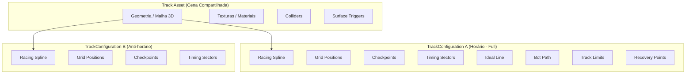

### TrackConfigurationSO (ScriptableObject)

```csharp
[CreateAssetMenu(fileName = "NewTrackConfig", menuName = "RKW/Track Configuration")]
public class TrackConfigurationSO : ScriptableObject
{
    [Header("Identificação")]
    public string trackConfigurationId;  // ID estável, nunca muda
    public string trackId;               // Referência à pista-pai
    public string displayName;
    public TrackDirection direction;      // Propriedade CANÔNICA desta configuração (clockwise/counterclockwise)
    
    [Header("Traçado")]
    public SplineData racingSpline;
    public SplineData idealLine;
    public SplineData botPath;
    public BrakingPoint[] brakingPoints;
    
    [Header("Grid e Posicionamento")]
    public GridPosition[] gridPositions;
    public string startLineId;       // ID estável, binding resolvido em runtime pelo scene component
    public string finishLineId;      // ID estável, binding resolvido em runtime pelo scene component
    public string pitEntryId;        // ID estável, binding resolvido em runtime pelo scene component
    public string pitExitId;         // ID estável, binding resolvido em runtime pelo scene component
    
    [Header("Cronometragem")]
    public Checkpoint[] checkpoints;
    public TimingSector[] sectors;
    
    [Header("Limites e Segurança")]
    public TrackLimitZone[] trackLimits;
    public EscapeArea[] escapeAreas;
    public RecoveryPoint[] recoveryPoints;
    public MarshalPost[] marshalPosts;
    public SignalPosition[] signals;
}
```

**Princípio:** Dados reutilizáveis (geometria, texturas) ficam na cena. Dados de layout (splines, checkpoints) ficam em ScriptableObjects por configuração. Não duplicar cenas inteiras. ScriptableObjects NÃO armazenam referências diretas de Transform da cena — usam IDs estáveis e dados serializados, com bindings resolvidos por scene components em runtime.

---

## Environment Presets System (R17)

### EnvironmentPresetSO

```csharp
[CreateAssetMenu(fileName = "NewPreset", menuName = "RKW/Environment Preset")]
public class EnvironmentPresetSO : ScriptableObject
{
    [Header("Identificação")]
    public string presetId;
    public string displayName;
    
    [Header("Iluminação")]
    public LightingProfile lightingProfile;  // Baked/Mixed preferred
    public Material skyboxMaterial;
    public float exposureValue;
    public Color ambientColor;
    public ShadowSettings shadowSettings;
    
    [Header("Noturno")]
    public bool isNight;
    public SpotlightConfig[] trackSpotlights;  // Karts sem faróis
    
    [Header("Pós-processamento")]
    public VolumeProfile postProcessingProfile;
    
    [Header("Ambiente")]
    public CrowdConfig crowdConfig;
    public float visibilityDistance;
    public AudioClip ambientAudioLoop;
    
    [Header("Performance")]
    public PerformanceBudgetOverride budgetOverride;  // Por tier
}
```

**Decisão:** Iluminação baked/mista para performance mobile. Noite depende de illuminação do kartódromo (karts sem faróis). Visibilidade essencial garantida em todos os perfis gráficos.

---

## Track Conditions System (R18)

### TrackConditionSO

```csharp
[CreateAssetMenu(fileName = "NewCondition", menuName = "RKW/Track Condition")]
public class TrackConditionSO : ScriptableObject
{
    [Header("Identificação")]
    public string conditionId;
    public string displayName;
    
    [Header("Grip Modifiers")]
    public float longitudinalGripMultiplier;  // 1.0 = dry baseline
    public float lateralGripMultiplier;
    public float brakingDistanceMultiplier;
    public float tractionMultiplier;
    public float curbGripMultiplier;
    public float grassGripMultiplier;
    public float rubberLineGripBonus;        // Bonus in rubber area
    
    [Header("Visuals")]
    public bool enablePuddles;
    public bool enableSpray;
    public float visibilityMultiplier;
    public ParticleSystemConfig rainParticles;
    
    [Header("Audio & Haptics")]
    public AudioClip ambientWeatherLoop;
    public HapticProfile weatherHaptics;
    
    [Header("Race Rules")]
    public bool canTriggerRedFlag;
    public float redFlagThreshold;  // Severity threshold
}
```

**MVP:** Apenas "Dry" (todos multipliers = 1.0). ScriptableObjects preparados para outras condições.

---

## Session Context and Leaderboard Keys (R19)

### Estrutura

O sistema define DOIS conceitos distintos:

**SessionContextKey** — contexto completo para telemetria e reprodução:
```csharp
[Serializable]
public struct SessionContextKey
{
    public string trackId;
    public string trackConfigurationId;  // Direction é propriedade canônica de TrackConfiguration
    public string kartCategoryId;
    public string trackConditionId;
    public string environmentPresetId;
    public GameMode gameMode;
    public int physicsVersion;
    public int trackVersion;
    public int rulesetVersion;
    public AssistClass assistClass;
    // Campos adicionais de telemetria (latência, controlType, etc.) podem ser incluídos
}
```

**LeaderboardKey** — APENAS dimensões que determinam comparabilidade competitiva:
```csharp
[Serializable]
public struct LeaderboardKey : IEquatable<LeaderboardKey>
{
    public string trackConfigurationId;  // Direction já é propriedade canônica de TrackConfiguration (evita duplicação)
    public string kartCategoryId;
    public string trackConditionId;
    public string environmentPresetId;   // Separa rankings SOMENTE quando afeta competitividade (ex: noite sim, manhã vs tarde provavelmente não)
    public GameMode gameMode;            // Separa SOMENTE quando regras alteram comparabilidade
    public int physicsVersion;
    public int trackVersion;
    public int rulesetVersion;
    public AssistClass assistClass;
    
    // Comparação estrita — todos os campos devem ser iguais
    public bool Equals(LeaderboardKey other) => /* all fields equal */;
    public override int GetHashCode() => /* hash all fields */;
}
```

> ⚠️ **Direction** é propriedade canônica de `TrackConfiguration`. O `TrackConfigurationId` já codifica a direção — NÃO há campo `Direction` duplicado no `LeaderboardKey`. Se `TrackConfigurationId` = "track01_cw", isso já implica sentido horário.

### AssistClass

Duas classes iniciais:
- **Standardized**: conjunto padronizado de assistências competitivas (definido por categoria)
- **Open**: qualquer combinação de assistências permitida

```csharp
public enum AssistClass
{
    Standardized,  // Conjunto competitivo padronizado por categoria
    Open           // Qualquer combinação
}
```

A combinação exata de assistências (steering: light, braking: none, etc.) é registrada como **metadados** do resultado, sem criar uma classe por combinação. O `LeaderboardKey` usa apenas o enum `AssistClass`, não a combinação completa.

### Política de Versionamento

| Mudança | Ação |
|---|---|
| Ajuste fino exclusivamente cosmético | Manter versão |
| Qualquer alteração de física, potência, grip, superfícies, checkpoints, limites, cronometragem ou regras que POSSA alterar tempos | Nova PhysicsVersion ou TrackVersion (NÃO usar threshold fixo — impacto depende do comprimento da pista) |
| Mudança de layout/checkpoint | Nova TrackVersion |
| Nova regra que afeta tempos | Nova RulesetVersion |

**Registros históricos preservados.** Tempos da versão anterior ficam visíveis como "Histórico v{N}" mas NÃO aparecem no ranking ativo.

---

## Timing and Sectors System (R20)

### Arquitetura de Cronometragem

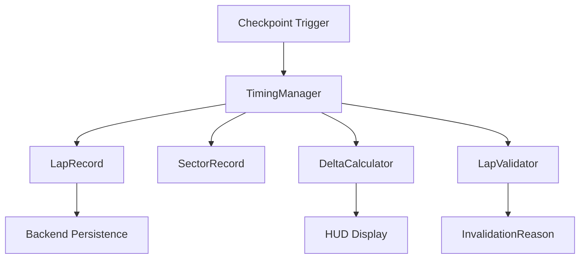

### LapRecord (Modelo de Dados)

```json
{
  "lapId": "uuid",
  "pilotId": "string",
  "sessionId": "string",
  "sessionContextKey": { /* SessionContextKey completa */ },
  "leaderboardKey": { /* derivada — para consultas de ranking */ },
  "lapNumber": 3,
  "totalTimeUs": 45230456,
  "sectorTimesUs": [15200123, 14980333, 15050000],
  "valid": true,
  "invalidationReason": null,
  "penalties": [],
  "timestamp": "ISO8601",
  "physicsVersion": 1,
  "controlType": "joystick",
  "assists": { "steering": "light", "braking": "none" },
  "latencyIndicators": { "avgMs": 45, "maxMs": 120, "packetLoss": 0.01 }
}
```

**Precisão:** Interno em microsegundos (µs). Exibição em milissegundos (ms). Nunca truncar antes de comparação.

---

## Sector Comparison (R21)

### Convenção Visual

| Estado | Cor | Ícone | Texto |
|---|---|---|---|
| Mais rápido | Verde | ▼ | -0.234 |
| Mais lento | Vermelho | ▲ | +0.567 |
| Sem referência | Cinza | — | — |
| Melhor pessoal do setor | Roxo | ★ | PB! |

**Acessibilidade:** Nunca depender APENAS de cor. Sempre combinar: sinal (+/-), ícone direcional e cor.

---

## Theoretical Ideal Lap (R22)

```
volta_ideal = Σ min(setor_i_valido) para i=1..N
             onde todos os setores vêm do MESMO LeaderboardKey
             E todas as voltas fonte são válidas
```

---

## Temporal Rankings Architecture (R23)

### Modelo Genérico

```csharp
public class RankingEntry
{
    public string pilotId;
    public LeaderboardKey key;
    public long bestTimeUs;
    public DateTime achievedAt;
    public RankingWindow window;
    public bool isActive;  // false = versão expirada
}

public enum RankingWindow
{
    Session, Personal, Friends, Championship,
    Daily, Weekly, Monthly, Season, AllTime
}
```

### Políticas

| Política | Decisão |
|---|---|
| Timezone | UTC interno; fronteiras definidas em UTC |
| Empate | Primeiro a alcançar vence (timestamp) |
| Invalidação | Tempo removido se piloto banido; rankings recalculados |
| Mudança de versão | Novo ranking; histórico preservado separadamente |

---

## Ghost System (R24)

### Formato de Ghost

```csharp
public class GhostRecording
{
    public string ghostId;
    public LeaderboardKey key;        // Determina compatibilidade competitiva
    public long lapTimeUs;
    public GhostSample[] samples;     // Amostras GRAVADAS (não re-simulação)
    public DateTime recordedAt;
    public bool isCompatible;         // false após mudança de physics/track version
}

public struct GhostSample
{
    public float timestamp;      // Relative to lap start
    public Vector3 position;     // Quantized
    public Quaternion rotation;  // Compressed
}
```

**Propriedades:**
- Sem colisão, sem interferência física
- Baseado em amostras GRAVADAS de posição/rotação (NÃO depende de re-simulação determinística)
- Associado a LeaderboardKey
- Descartado/marcado incompatível após mudanças relevantes
- Limites de tamanho: ~50KB por ghost (comprimido)
- **MVP:** 1 ghost pessoal (melhor volta) por LeaderboardKey, armazenado LOCALMENTE
- **Alpha/Beta:** Cloud ghosts, ghost de amigo, múltipla retenção

---

## Private Championship (R25 — expande R2)

### Configuração

```json
{
  "championshipId": "uuid",
  "name": "Liga dos Amigos",
  "adminId": "pilotId",
  "participants": ["id1", "id2", ...],
  "calendar": [
    {
      "stageNumber": 1,
      "trackId": "track_01",
      "trackConfigurationId": "config_cw",
      "category": "rentalSport",
      "qualifyingFormat": "3_attempts",
      "raceLaps": 10,
      "practice": true
    }
  ],
  "scoring": {
    "preset": "standard_10",
    "points": [25, 18, 15, 12, 10, 8, 6, 4, 2, 1],
    "bonuses": {
      "pole": { "enabled": false, "points": 1 },
      "fastestLap": { "enabled": false, "points": 1 },
      "cleanRace": { "enabled": false, "points": 2 },
      "mostPositionsGained": { "enabled": false, "points": 1 }
    },
    "discardWorst": 0,
    "tiebreaker": "most_wins_then_most_seconds"
  }
}
```

---

## Driving Instructor System (R28)

### Arquitetura

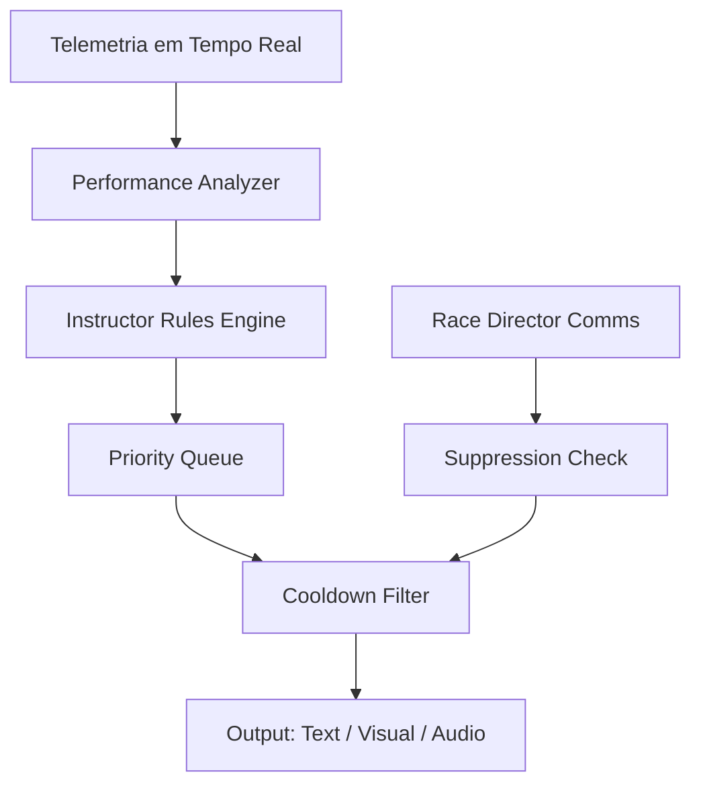

### Regras de UX do Instrutor

| Regra | Valor |
|---|---|
| Cooldown mínimo entre mensagens | 5 segundos |
| Max mensagens por volta | 4 |
| Prioridade: segurança > técnica > informação | Sempre |
| Supressão durante comunicação da direção | Sim |
| Desabilitar opção | Sim (settings) |
| Volume separado | Sim |
| Legendas/subtítulos | Obrigatório |

---

## Challenge System (R29)

### Template de Desafio

```csharp
[CreateAssetMenu(fileName = "NewChallenge", menuName = "RKW/Challenge Template")]
public class ChallengeTemplateSO : ScriptableObject
{
    public string templateId;
    public string displayName;
    public string description;
    public ChallengeType type;
    public ChallengeCondition condition;
    public RewardConfig reward;
    public TimeSpan duration;  // Daily, weekly, etc.
}

public enum ChallengeType
{
    ImprovePB, ConsistentLaps, NoContact, NoPenalty,
    WinWithoutIdealLine, CompleteTraining, GainPositions, BeatGhost
}
```

**Ativação:** Remote Config pode ativar, desativar e parametrizar templates de desafio já incluídos no build. Novos tipos de desafio, lógica ou assets exigem atualização do aplicativo.

---

## Explainable Race Direction (R31)

### Registro de Penalidade

```json
{
  "penaltyId": "uuid",
  "type": "track_limits_exceeded",
  "moment": { "lap": 3, "sector": 2, "timestamp": "ISO8601" },
  "rule": "Limites de pista - 4 rodas fora",
  "evidence": { "checkpointId": "cp_07", "gainMs": 234 },
  "punishment": { "type": "time_penalty", "valueMs": 3000 },
  "consequence": "3 segundos adicionados ao tempo total",
  "origin": "automatic",
  "appealed": false
}
```

---

## Interface Design Principles (R35)

### Modos de Interface

| Modo | Durante Corrida | Pós-Volta | Pós-Corrida |
|---|---|---|---|
| Essencial | Posição, volta, tempo, delta simples, bandeira, vizinho | Tempo, delta, PB, válida/inválida | Resultado completo |
| Completo | + setores, gap frente/atrás, tendência | + setores, ideal, consistência | + gráficos, comparação |
| Customizado | Piloto escolhe widgets | Piloto escolhe | Piloto escolhe |

**Regra:** Nunca mostrar toda telemetria durante pilotagem. Área de análise separada para dados avançados.

---

## Scope Guardrails (Matriz de Fases)

### Arquitetura Preparada AGORA (sem implementar funcionalidade)

| Item | Como Preparar |
|---|---|
| TrackConfiguration | SO + ID estável na arquitetura; NÃO usar Transform direto em SO (usar IDs estáveis com bindings resolvidos em runtime) |
| SessionContextKey / LeaderboardKey | Structs imutáveis referenciadas em todo o código de timing |
| EnvironmentPreset | SO + interface de preset loading |
| TrackCondition | SO + grip multiplier interface |
| Setores e timing | TimingManager com N setores configurável (MVP: 3 setores; aceita 1-6 por TrackConfiguration) |
| Physics/Track versioning | Campos de versão no LeaderboardKey |
| Generic ranking windows | RankingWindow enum + interface genérica |
| Extensible telemetry | Schema extensível (campos opcionais) |
| Feature flags | Remote Config para toda feature nova (ativa templates existentes; NÃO cria novos SOs) |
| Ghost format | GhostRecording com LeaderboardKey + amostras gravadas |
| Track Evolution | Documentar extension points; NÃO implementar interfaces/serviços/SOs sem consumidor real |
| AssistClass | Enum (Standardized, Open); combinação exata é metadado |

### MVP Implementado

| Item | Escopo |
|---|---|
| 1 pista fictícia | Geometria + colliders + superfícies |
| 1 configuração (sentido horário) | Spline + checkpoints + setores + grid |
| Dia (preset único) | Iluminação baked padrão |
| Seco (condição única) | Multipliers = 1.0 |
| Categorias 6,5 HP e 13 HP | Duas categorias no MVP |
| Até 4 humanos + 6 bots | Limite de sala |
| 3 setores | Cronometragem com 3 setores (arquitetura aceita 1-6) |
| PB + session best | Rankings básicos |
| Delta simples | Texto pós-setor |
| Volta ideal teórica | Calculada pós-corrida |
| Ranking versão atual | AllTime com single LeaderboardKey |
| 1 ghost pessoal (local) | Por LeaderboardKey, armazenado localmente |
| Campeonato privado básico | Preset "Standard 10" (sem bônus, sem descarte) |
| Resultado com penalidades | Tipo + momento + regra |
| Caderno simples | Melhores tempos, wins, pódios |
| UI Essencial | Mínimo durante corrida, completo pós-corrida |
| Instrutor texto+visual (pt-BR) | Mensagens básicas, cooldown, prioridade. Unity Localization / String Tables. |
| Desafio onboarding estático (opcional) | Remote Config ativa template existente |
| Standing start configurável | Semáforo parametrizável + false start detection |
| Rankings NÃO-OFICIAIS (Shared Mode) | Claramente marcados como não-oficiais |
| Monetização exclusivamente cosmética | Zero impacto em gameplay |

### Alpha/Beta

| Item | Escopo |
|---|---|
| Direção anti-horária | 2ª configuração da pista |
| Noite | EnvironmentPreset noturno |
| Úmido (damp) | TrackCondition com multipliers leves |
| Rankings diário/semanal/mensal | Janelas temporais |
| Desafio assíncrono | Ghost de amigo + invite |
| Desafios diários/semanais | Rotação via Remote Config de templates existentes |
| Ghost de amigo (cloud) | Cloud sync + múltiplos ghosts retidos |
| Instrutor áudio + inglês | Vozes básicas + localização EN |
| Cartão compartilhável | Geração de imagem para redes sociais |
| Consistência avançada | Histórico + gráficos |
| Campeonato completo | Bônus, descarte, presets adicionais |

### Pós-Lançamento

| Item | Escopo |
|---|---|
| Múltiplos layouts | Curto, técnico, etc. |
| Chuva (light + heavy) | Condições com spray, poças, red flag |
| Clima variável durante sessão | Transição dinâmica |
| Evolução de pista | Grip progressivo, borracha |
| Lastro/peso | Categorias de peso, equalização |
| Largada lançada | Rolling start, formação |
| Replay de incidente | Visualização de penalidade |
| Real Track Partner Platform | Licenciamento, fotogrametria, Addressables |
| Pistas reais licenciadas | Pipeline completo |
| Rankings regionais/globais | Temporadas, seasons |
| Coach adaptativo | ML-based feedback |
| Campeonatos híbridos | Virtual + presencial |
| Revenue sharing | Parceiros, patrocinadores |

---

## Correctness Properties

*A property is a characteristic or behavior that should hold true across all valid executions of a system — essentially, a formal statement about what the system should do. Properties serve as the bridge between human-readable specifications and machine-verifiable correctness guarantees.*

### Property 1: Serialization Round-Trip

*For any* valid game data object (player profile, control layout, ghost recording, race result), serializing and then deserializing should produce an object equivalent to the original.

**Validates: Requirements 2.3, 3.7, 10.5**

---

### Property 2: Session Participant Invariant

*For any* sequence of join and leave events in a race session, the number of participants (humans + bots) shall never exceed 10.

**Validates: Requirements 1.2**

---

### Property 3: Grid Ordering by Best Qualifying Time

*For any* set of qualifying lap times for N pilots, the resulting grid shall be sorted in ascending order by each pilot's minimum valid lap time.

**Validates: Requirements 1.3**

---

### Property 4: Throttle Ramp Rate Limit

*For any* sequence of throttle inputs over time, the output throttle value shall never increase faster than 1/0.15 per second (150 ms minimum to reach full throttle from zero).

**Validates: Requirements 3.5**

---

### Property 5: Weight Transfer Monotonicity

*For any* kart at speed above threshold, increasing the steering angle shall increase weight on the outer rear wheel and decrease weight on the inner rear wheel monotonically.

**Validates: Requirements 4.2**

---

### Property 6: Steering Speed Loss

*For any* kart at elevated speed, increasing the steering angle shall increase speed loss proportionally — speed loss is monotonically increasing with steer angle magnitude.

**Validates: Requirements 4.3**

---

### Property 7: Straight Braking Superiority

*For any* initial speed above minimum threshold, the stopping distance when braking in a straight line shall be less than the stopping distance when braking with any non-zero steering angle applied.

**Validates: Requirements 4.4**

---

### Property 8: Brake-Steer Oversteer

*For any* speed and non-zero steer angle, adding braking force shall increase lateral slip (oversteer tendency) compared to the same steer angle without braking.

**Validates: Requirements 4.5**

---

### Property 9: Surface Grip Reduction

*For any* kart state, the grip coefficient on grass or dirt surface shall be at most 60% of the grip coefficient on dry asphalt (i.e., reduction ≥ 40%).

**Validates: Requirements 4.7**

---

### Property 10: Slipstream Drag Reduction Monotonicity

*For any* two distances d1 < d2 both within slipstream activation range (≤ 1.5 kart lengths), the drag reduction at d1 shall be greater than or equal to the drag reduction at d2.

**Validates: Requirements 4.8**

---

### Property 11: Recovery Trigger Conditions

*For any* collision event regardless of severity, the system shall NOT trigger automatic recovery/repositioning. Recovery shall be triggered ONLY when the kart meets one of the explicit stuck/inverted/out-of-bounds/hazard conditions.

**Validates: Requirements 4.10, 4.11**

---

### Property 12: Category Differentiation

*For any* pair of distinct kart categories, at least maxSpeed, acceleration time, and lateral grip parameters shall have different values.

**Validates: Requirements 5.3**

---

### Property 13: License Gating

*For any* player license state, access to category N requires possession of license for category N-1. A player without license N-1 cannot enter a session of category N.

**Validates: Requirements 5.4**

---

### Property 14: Category Equalization in Online Sessions

*For any* online race session, all participants (human and bot) shall use the same kart category ScriptableObject.

**Validates: Requirements 5.5**

---

### Property 15: Sector Delta Calculation

*For any* set of reference sector times and actual sector times, the delta for each sector shall equal (actual_time - reference_time), correctly signed.

**Validates: Requirements 6.5**

---

### Property 16: License Granting Logic

*For any* license exam result, the license shall be granted if and only if the lap time ≤ threshold AND all laps are valid.

**Validates: Requirements 6.6**

---

### Property 17: Yellow Flag Penalty Minimum

*For any* overtake event detected while yellow flag is active in the sector, the applied time penalty shall be ≥ 3 seconds.

**Validates: Requirements 7.3**

---

### Property 18: Ambiguous Collision Non-Penalty

*For any* collision classified as ambiguous by the Race Direction criteria (e.g., racing incident with convergent trajectories where fault is unclear), no automatic penalty shall be applied. The event shall be registered for investigation without immediate punishment.

**Validates: Requirements 7.9**

---

### Property 19: Bot Error Within Tolerance

*For any* bot profile and intentional error event, the deviation magnitude shall be within the minimum and maximum bounds defined by that profile's ScriptableObject.

**Validates: Requirements 8.3**

---

### Property 20: XP Calculation Determinism

*For any* valid race result (position 1–10, laps 0–10, penalties list, clean flag), the XP calculation shall be deterministic and produce a non-negative integer matching the formula: base + position_bonus + clean_bonus - penalty_reduction.

**Validates: Requirements 10.1**

---

### Property 21: Clean Driving Index Bounds

*For any* sequence of race events applied to a clean driving index starting at 80, the resulting index shall remain within [0, 100] inclusive.

**Validates: Requirements 10.3**

---

### Property 22: Cosmetics Have Zero Gameplay Effect

*For any* cosmetic item or combination of cosmetic items equipped on a kart, all physics-relevant parameters (maxSpeed, acceleration, grip, braking, inertia) shall remain identical to the base category values.

**Validates: Requirements 11.1, 11.2**

---

### Property 23: Ad Interval Minimum

*For any* sequence of interstitial ad display events, the time between consecutive displays shall be ≥ 5 minutes (300 seconds).

**Validates: Requirements 11.4**

---

### Property 24: Quality Auto-Adjust with Hysteresis

*For any* FPS history where average FPS in a 3-second sampling window < 28 for a continuous period, the quality level shall decrease by exactly 1 level. Upgrade shall occur ONLY when: average FPS in 10-second window > 55 AND cooldown of 30 seconds since last change is satisfied AND hysteresis margin of 5 FPS above downgrade threshold is met.

**Validates: Requirements 12.5**

---

### Property 25: Analytics Event Anonymization

*For any* analytics event generated by the telemetry system, the event payload shall contain no personally identifiable information (no email, real name, phone number, precise location, or device identifiers that could identify an individual).

**Validates: Requirements 13.3**

---

### Property 26: Economy Non-Negative Balance Invariant

*For any* sequence of economy transactions (earn, spend), the resulting balance of any currency shall never be negative. A transaction that would result in negative balance shall be rejected.

**Validates: Requirements 10 (implied), AGENTS.md Rule 12**

---

### Property 27: Matchmaking Room Code Uniqueness

*For any* batch of N generated room codes, all codes shall be exactly 6 alphanumeric characters and all shall be unique within the batch.

**Validates: Requirements 2.4**

---

### Property 28: LeaderboardKey Strict Equality

*For any* two LeaderboardKey instances, they are equal if and only if ALL constituent fields (trackConfigurationId, kartCategoryId, trackConditionId, environmentPresetId, gameMode, physicsVersion, trackVersion, rulesetVersion, assistClass) are identical. Changing any single field shall produce inequality. Note: Direction is encoded within TrackConfigurationId and does not appear as a separate field.

**Validates: Requirements 19.2, 19.5**

---

### Property 29: Rankings Respect LeaderboardKey

*For any* ranking query filtered by a specific LeaderboardKey, all returned entries shall have an identical LeaderboardKey. No entry with a differing key shall ever appear in the results, regardless of time value.

**Validates: Requirements 16.3, 19.5, 23.2**

---

### Property 30: Theoretical Ideal Lap Correctness

*For any* set of valid lap records sharing the same LeaderboardKey, the theoretical ideal lap time shall equal the sum of the minimum valid sector time for each sector index. Sectors from laps with a different LeaderboardKey or from invalid laps shall never contribute to the ideal calculation.

**Validates: Requirements 22.1, 22.3**

---

### Property 31: Ghost Zero Physics Interference

*For any* race simulation, the presence or absence of a ghost visualization shall produce zero difference in any kart's physics state (position, velocity, rotation, forces). Ghosts have no collision and no physics interaction.

**Validates: Requirements 24.3**

---

### Property 32: Championship Scoring Determinism

*For any* valid set of race results and a scoring configuration (point preset, bonuses, discard rule), the championship standings calculation shall be deterministic and produce the same ranking for the same inputs. Points shall equal the sum of scored results minus discarded worst results.

**Validates: Requirements 25.1, 25.2**

---

### Property 33: Consistency Calculation Correctness

*For any* set of N valid comparable lap times (same LeaderboardKey), the consistency metrics (mean, standard deviation, range) shall be mathematically correct: mean = sum/N, stddev = sqrt(sum((t-mean)²)/(N-1)), range = max - min.

**Validates: Requirements 26.1, 26.2**

---

### Property 34: Penalty Metadata Completeness

*For any* penalty event generated by the Race Direction system, the record shall contain all mandatory fields: type, moment (lap + sector + timestamp), rule applied, punishment value, consequence description, and origin (automatic/manual). No mandatory field shall be null or empty.

**Validates: Requirements 31.1**

---

### Property 35: Track Condition Alters Grip

*For any* TrackCondition other than "dry" (baseline), at least one grip multiplier (longitudinal, lateral, braking, traction, curb, grass) shall differ from 1.0, ensuring the condition has a measurable effect on physics behavior.

**Validates: Requirements 18.2**

---

## Revisão Cruzada: Contradições Encontradas e Correções

### Correções Aplicadas nesta Iteração (25 Correções da Revisão Final)

| # | Correção | Impacto |
|---|---|---|
| 1 | Qualifying: "3 tentativas cronometradas" (não "3 laps") em todos diagramas e descrições | R1.3, State Machine |
| 2 | Race End: timeout 60s (configurable via Remote Config) após líder terminar; REMOVIDA alternativa "2 voltas adicionais do líder" | R1.6, Finished state |
| 3 | Recovery: parâmetro ÚNICO configurável 4s para kart preso/imóvel; eliminada divergência 3s/4s; colisão NUNCA aciona recovery | R4.11, R7.6, Error Handling |
| 4 | Shared Mode: REMOVIDAS promessas de "correção autoritativa em tempo real" — apenas plausibility checks e anomaly detection pós-corrida | Security, Limitations |
| 5 | HOST → SubmittingClient; IsHost → HasStateAuthority; host migration → session recovery | INetworkTransport, Sequence Diagrams |
| 6 | Privacidade: base legal depende da finalidade (consentimento, contrato, interesse legítimo, obrigação legal) | R13.4 |
| 7 | CI/CD: builds internos AUTO; TestFlight external/Google Play closed beta requerem aprovação; produção SEMPRE gate humano | Pipeline diagram |
| 8 | Bundle ID: PROVISÓRIO; REMOVIDA asserção "já definido e estável"; NÃO registrar apps antes de decisão | Decisões Reversíveis |
| 9 | PhysX NÃO promete determinismo; descrição como "reprodutibilidade aproximada dentro de tolerâncias"; ghost usa amostras GRAVADAS | Física, Ghost |
| 10 | TrackConfigurationSO: NÃO armazena Transform direto da cena; usa IDs estáveis + bindings em runtime | TrackConfigurationSO |
| 11 | SessionContextKey vs LeaderboardKey separados; Direction é propriedade canônica de TrackConfiguration (sem duplicação) | SessionContextKey, LeaderboardKey, Rankings |
| 12 | AssistClass: Standardized + Open; combinação exata é METADADO; LeaderboardKey usa apenas enum | AssistClass, LeaderboardKey |
| 13 | 3 setores no MVP; arquitetura aceita 1-6 configuráveis por TrackConfiguration | Timing, Scope |
| 14 | Ghost: MVP = 1 ghost pessoal LOCAL por LeaderboardKey; cloud/friend/múltipla retenção = Alpha/Beta | Ghost System |
| 15 | Championship: preset "Standard 10" (sem nome "F1"); bônus e descartes são Alpha/Beta | Championship, Scoring |
| 16 | Instrutor: pt-BR MVP, Unity Localization / String Tables obrigatório; inglês = Alpha/Beta | R28, Instructor |
| 17 | Competitive Versioning: sem threshold fixo "0.5s"; impacto depende do comprimento da pista | Versioning Policy |
| 18 | Remote Config ativa templates EXISTENTES (não cria SOs); desafios diários/semanais → Alpha/Beta; MVP: onboarding estático opcional | R29, Challenges |
| 19 | Shareable Card: Alpha/Beta (não MVP) | R30, Scope |
| 20 | Track Evolution: apenas documentação de extension points no MVP; sem interfaces/serviços/SOs sem consumidor | R32, Traceability |
| 21 | Yellow Flag: sem limite fixo de velocidade; comportamento vem do Ruleset (reduzir speed, proibir ultrapassagem, ref delta futuro) | R7.2 |
| 22 | Start Procedure: luzes configuráveis pelo Ruleset/StartProcedure (não rígido "5 luzes") | R34, Starting state |
| 23 | Network Region: "menor latência disponível para audiência BR" (não "São Paulo" absoluto) | Diagrams, ADR |
| 24 | MVP scope enforced: categorias 6.5/13HP, até 4+6, 3 setores, delta simples, rankings NÃO-OFICIAIS, sem daily challenges, sem shareable card | Scope Guardrails |
| 25 | Document Consistency: client FORNECE dados → backend verifica plausibilidade; Recovery 4s everywhere; qualifying "3 tentativas" everywhere | Cross-document |

### Contradições Originais Identificadas e Resolvidas (mantidas)

| # | Contradição | Documentos | Correção Aplicada |
|---|---|---|---|
| 1 | `docs/15-android-ios-release.md` usava placeholder `com.kartrentalgame.app` | docs/15 vs Decisão #2 | Atualizado com IDs corretos |
| 2 | `docs/04-driving-physics.md` listava Q-PH-01 como aberta | docs/04 vs Decisão #1 | Marcado RESOLVIDO |
| 3 | `docs/08-multiplayer-architecture.md` listava Q-MP-01 como aberta | docs/08 vs Decisão #1 | Marcado RESOLVIDO |
| 4 | `docs/20-open-questions.md` questões bloqueantes | docs/20 vs Decisões | Todas RESOLVIDAS |
| 5 | `requirements.md` Req 4 ambíguo sobre PhysX | requirements vs Decisão #1 | Atualizado |
| 6 | `requirements.md` Req 9 sem limitação Shared Mode | requirements vs Decisão #1 | Adicionados critérios |
| 7 | `requirements.md` Req 14 sem bundle IDs | requirements vs Decisão #2 | Adicionado critério |
| 8 | `docs/04-driving-physics.md` determinismo absoluto | docs/04 | Esclarecido: tolerâncias |
| 9 | `docs/17-roadmap.md` sem Real Track Partner | docs/17 | Adicionado M12 |
| 10 | `docs/08-multiplayer-architecture.md` sem restrições explícitas | docs/08 | Detalhado |

### Ambiguidades Identificadas (esclarecidas no design)

| # | Ambiguidade | Resolução no Design |
|---|---|---|
| 1 | Como camada custom interage com PhysX? | Diagrama: PhysX faz colisões, custom aplica forças |
| 2 | Biblioteca de PBT em C#/Unity? | Baseline NUnit com geradores determinísticos; FsCheck pendente de compatibilidade comprovada |
| 3 | Como resultados não dependem do client? | Cloud Code valida plausibilidade pós-corrida |
| 4 | Quando migrar de Shared para Server? | Gate: antes de ranked/prêmios/economia |
| 5 | "Determinismo prático"? | Fixed Timestep + tolerâncias (±0.01m, ±0.1 km/h) |
| 6 | Shared Mode = host authority? | NÃO. Autoridade distribuída. Cada client é dono do seu estado |
| 7 | Colisão forte → recovery automático? | NÃO. Recovery APENAS por stuck/invertido/fora/risco |
| 8 | Como comparar tempos de versões diferentes? | LeaderboardKey. Não se comparam — rankings separados |
| 9 | Quanto telemetria é "mínima"? | R15 define: setores, tempo, penalidades, colisões, disconnects |

---

## Questões Ainda Bloqueantes ou Pendentes

Após resolução das 3 questões bloqueantes originais (Q-PH-01, Q-MP-01, Q-RL-01), **não há mais questões 🔴 bloqueantes**.

### Questões de Prioridade Alta (🟠) que requerem ação em M1

| ID | Questão | Owner |
|---|---|---|
| Q-PV-02 | Idade mínima de cadastro e controle parental | Fundador + jurídico |
| Q-PV-03 | Nome provisório "Rental Kart World" — registro de marca | Fundador |
| Q-AA-02 | Wwise/FMOD ou Unity Audio nativo | Agente (ADR potencial) |
| Q-MP-02 | Custo mensal Photon para 1.000 CCU | Fundador |
| Q-BD-01 | Limite de storage Cloud Save por jogador | Agente |
| Q-BD-03 | Procedimento LGPD/GDPR para exclusão no UGS | Agente |
| Q-SP-01 | Consultor jurídico para Política de Privacidade | Fundador |
| Q-TS-01 | Dispositivos exatos da matriz de testes | Fundador |

---

## Principais Diagramas (Resumo Visual)

Os seguintes diagramas Mermaid estão incluídos neste documento:
1. **Arquitetura de alto nível** — visão geral de cliente, rede e backend
2. **Modelo de cenas** — como as scenes se organizam
3. **Fluxo de corrida** — sequência completa matchmaking → resultado
4. **Máquina de estados** — estados da corrida e transições
5. **Arquitetura de física** — PhysX + Custom Layer + ScriptableObjects
6. **Pipeline de CI/CD** — push → test → build → distribute
7. **Caminho de migração multiplayer** — Shared → Server authority
8. **Validação de resultado** — fluxo Cloud Code
9. **Pipeline Real Track Partner** — captura → modelagem → publicação
10. **Gantt do roadmap** — M1 a M12

---

## Nota Final

Este documento de design:
- ✅ Endereça todos os 36 requisitos do `requirements.md` (14 originais + 22 novos R15–R36)
- ✅ Incorpora as 3 decisões aprovadas (Física, Identificadores, Real Track Partner Platform)
- ✅ Aplica 25 correções da revisão final corretiva + 5 correções de consistência final
- ✅ Separa SessionContextKey (telemetria/auditoria) de LeaderboardKey (comparabilidade competitiva) — tipo único `CompetitiveSessionKey` eliminado
- ✅ Define AssistClass como enum (Standardized, Open) com combinação como metadado
- ✅ JSON usa `sessionContextKey` + `leaderboardKey` (campo `competitiveSessionKey` eliminado)
- ✅ Remote Config: ativa/parametriza templates existentes; novos tipos exigem app update
- ✅ Privacidade: aviso claro no primeiro boot; consentimento explícito apenas quando base legal aplicável; Player IDs pseudonimizados (não anônimos); exclusão respeita hipóteses legais
- ✅ Identifica riscos técnicos e protótipos necessários
- ✅ Define caminho de migração para server authority
- ✅ Estabelece 35 propriedades de corretude testáveis
- ✅ Documenta Scope Guardrails (MVP vs Alpha/Beta vs Pós-lançamento)
- ✅ Remove promessas incompatíveis com Shared Mode (correção autoritativa em tempo real)
- ✅ PhysX descrito como reprodutibilidade aproximada (não determinismo)
- ✅ Ghost usa amostras gravadas (não re-simulação)
- ✅ Bundle ID marcado como PROVISÓRIO
- ✅ Markdown code blocks validados (abertura/fechamento par)
- ✅ Não gera código
- ✅ Não gera `tasks.md`
- ✅ Não inicia implementação

**Próximo passo:** Revisão pelo fundador → iteração se necessário → geração de `tasks.md` quando aprovado.
