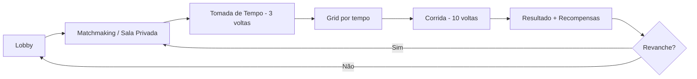
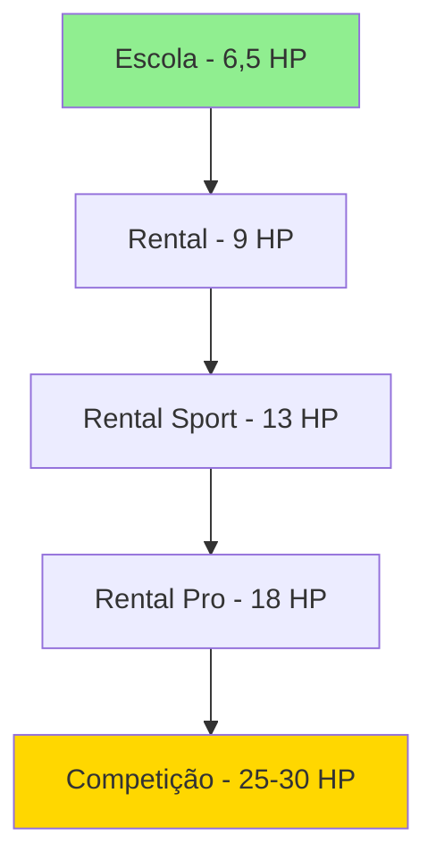

# 02 — Game Design Document (GDD)

## Objetivo e Escopo

Definir mecânicas centrais, loops de gameplay, modos de jogo, progressão e sensação de dirigibilidade do jogo de kart rental mobile.

---

## Pilares de Design

1. **Autenticidade** — Fundamentos reais de pilotagem de kart rental.
2. **Acessibilidade** — Qualquer pessoa com celular consegue jogar; pilotos reais se sentem em casa.
3. **Fair Play** — Vantagem vem exclusivamente da habilidade; sem pay-to-win.
4. **Comunidade** — Feito por e para pilotos de kart rental.

---

## Core Loop

---

## Modos de Jogo

### MVP

| Modo | Online | Bots | Descrição |
|---|---|---|---|
| Escola de Pilotagem | ❌ | ❌ | 10 módulos progressivos offline |
| Treino Livre | ❌ | Opcional | Sem limite de voltas, sem ranking |
| Tomada de Tempo | ❌ | Ghost | 3 voltas, ghost da melhor |
| Corrida Offline | ❌ | ✅ | 10 voltas vs bots |
| Sala Privada | ✅ | Completam | Código de 6 chars, até 10 pilotos |
| Partida Rápida | ✅ | Completam | Matchmaking automático |
| Campeonato Privado | ✅ | ❌ | Séries entre amigos |

### Pós-MVP

- Ranking Competitivo com divisões e temporadas.
- Campeonatos abertos com prêmios cosméticos.
- Pistas licenciadas.
- Modo Endurance (corrida longa).

---

## Sessão Padrão de Corrida

1. **Lobby** — Pilotos entram; countdown de 30 s quando mínimo atingido (2 humanos ou 1 + bots).
2. **Tomada de Tempo** — 3 voltas individuais, melhor tempo define grid.
3. **Formação de Grid** — Animação breve mostrando posições.
4. **Largada** — Semáforo 5 luzes → apagar. Queima de largada detectada.
5. **Corrida** — 10 voltas com bandeiras, penalidades, vácuo.
6. **Checkered Flag** — Última volta computada.
7. **Resultado** — Posição, melhor volta, penalidades, XP, licença.
8. **Pós-corrida** — Revanche, replay curto, compartilhar resultado.

---

## Categorias e Progressão

Cada categoria altera: aceleração, velocidade máxima, frenagem, aderência, inércia, sensibilidade ao erro e tolerância do modelo de física.

---

## Escola de Pilotagem — Currículo

| Módulo | Tema | Critério de Aprovação |
|---|---|---|
| 1 | Equipamentos e segurança | Completar briefing interativo |
| 2 | Acelerar, aliviar, frear e parar | Parar no box dentro da zona |
| 3 | Slalom e suavidade | Completar sem derrubar cones |
| 4 | Frenagem em reta (50/30/10) | Frear antes da placa correta |
| 5 | Traçado: entrada, ápice e saída | Delta ≤ +0,5 s vs ideal (hipótese) |
| 6 | Controle de sobre-esterço | Recuperar 3 situações induzidas |
| 7 | Ultrapassagem e defesa | Completar sem contato |
| 8 | Vácuo e distância de frenagem | Manter vácuo por 3 s + frear limpo |
| 9 | Bandeiras e conduta | Quiz interativo + aplicação em pista |
| 10 | Prova de licença | N voltas válidas com tempo ≤ threshold |

---

## Vácuo (Slipstream)

- **Ativação:** Kart atrás de outro a ≤ 1,5 comprimentos, alinhado, por ≥ 1 s.
- **Efeito:** Redução progressiva de arrasto frontal, até ~8% (hipótese de calibração).
- **Visual:** Leve distorção de ar ou partículas, sem flames/nitro.
- **Áudio:** Mudança sutil na frequência de vento.
- **Balanceamento:** Piloto da frente não perde velocidade; quem está atrás ganha leve vantagem em retas mas perde ao sair do cone.

---

## Garagem e Cosméticos

Itens disponíveis (todos puramente cosméticos no competitivo online):

- Capacetes e viseiras
- Balaclavas
- Luvas
- Macacões e botas
- Pinturas e números do kart
- Adesivos originais
- Aparência do box e equipe
- Comemorações de pódio
- Molduras de perfil

---

## Sensação Desejada

> O jogador deve sentir que está aprendendo a pilotar um kart real. Os primeiros minutos são lentos e instrutivos. Após dominar frenagem e traçado, a sensação de velocidade e controle cresce organicamente. Um piloto real do kartódromo deve reconhecer os fundamentos imediatamente.

---

## Decisões Confirmadas

1. 10 voltas de corrida + 3 de classificação.
2. Até 10 participantes por sessão.
3. MVP: 4 humanos + 6 bots.
4. Sem armas/poderes/nitro em nenhum modo.
5. Progressão por categoria com licença.

## Suposições

| ID | Suposição | Validação |
|---|---|---|
| GDD-01 | 10 voltas é duração ideal para sessão mobile (~5 min) | Telemetria de sessão no alpha |
| GDD-02 | 3 voltas de quali são suficientes para definir grid justo | Análise de variância de tempos |
| GDD-03 | Countdown de 30 s equilibra espera vs preenchimento | Telemetria de matchmaking |

## Questões Abertas

- Q-GDD-01: Voltas de corrida devem ser configuráveis por sala privada?
- Q-GDD-02: Ghost compartilhável entre amigos na tomada de tempo?
- Q-GDD-03: Replay completo ou apenas highlight reel?

## Links Relacionados

- [Física](./04-driving-physics.md)
- [Controles](./05-controls-accessibility.md)
- [Bots](./07-ai-bots.md)
- [Progressão](./10-progression-economy.md)
