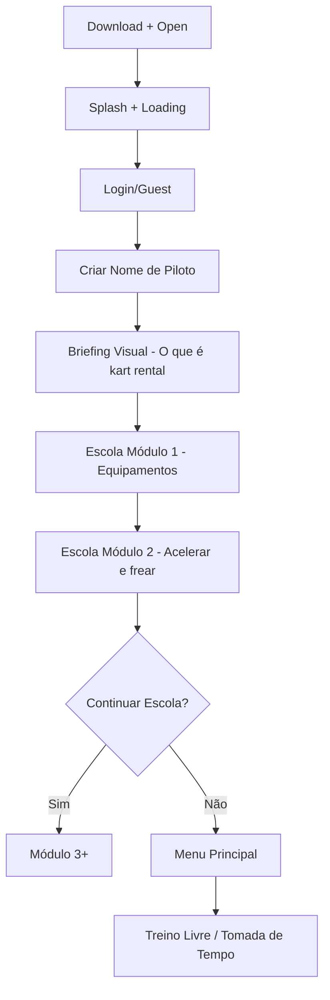
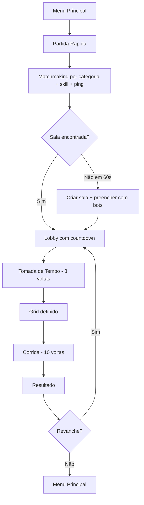
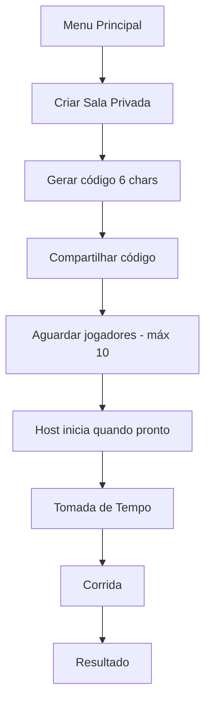
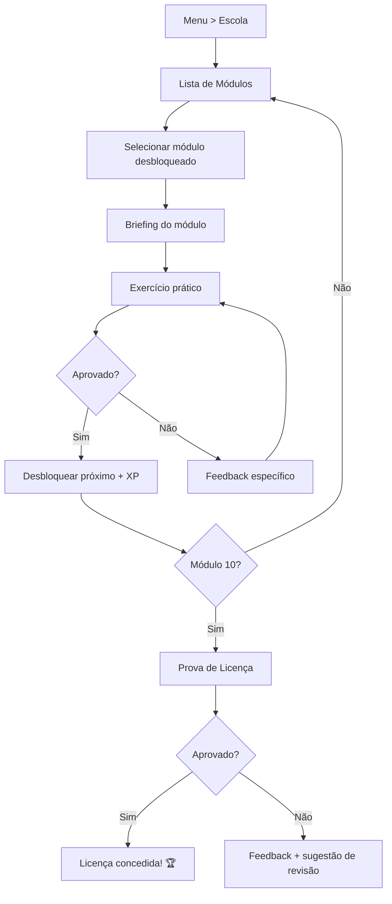
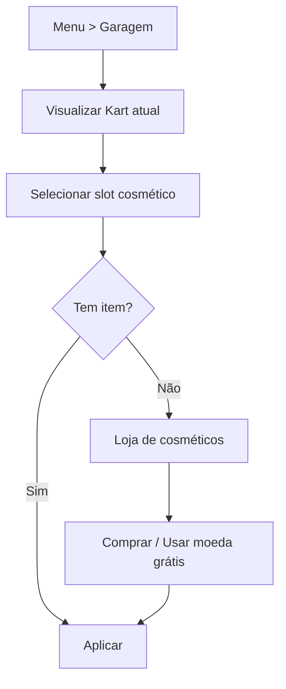
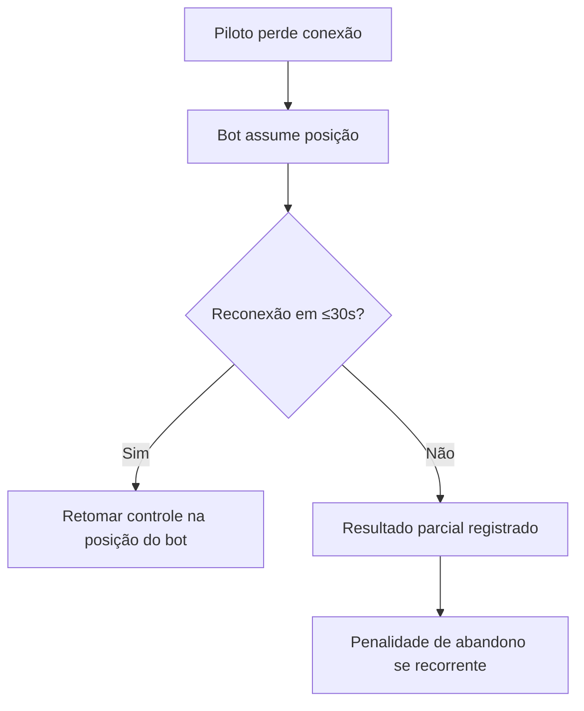
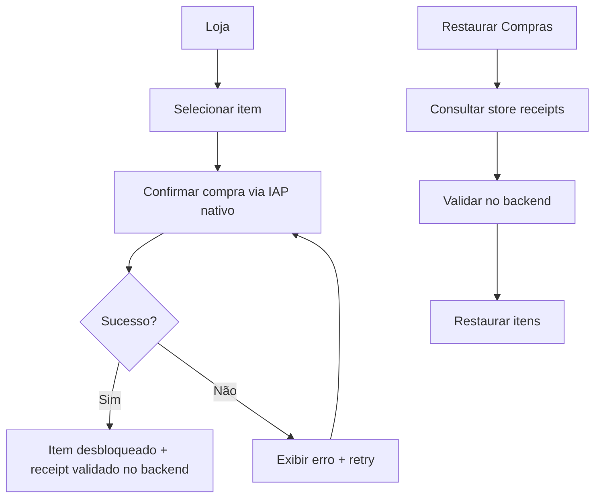

# 03 — User Flows

## Objetivo e Escopo

Documentar as jornadas principais do jogador desde o primeiro acesso até loops de retenção, com diagramas Mermaid.

---

## Flow 1 — Primeiro Acesso (FTUE)

---

## Flow 2 — Corrida Rápida Online

---

## Flow 3 — Sala Privada

---

## Flow 4 — Escola de Pilotagem

---

## Flow 5 — Garagem e Cosméticos

---

## Flow 6 — Desconexão e Reconexão

---

## Flow 7 — Compra e Restauração

---

## Decisões Confirmadas

1. FTUE direciona para Escola antes do multiplayer.
2. Matchmaking timeout de 60 s antes de preencher com bots.
3. Reconexão permitida em até 30 s.

## Suposições

| ID | Suposição | Validação |
|---|---|---|
| UF-01 | FTUE curta (< 3 min até primeira pilotagem) retém melhor | Teste A/B no soft launch |
| UF-02 | Código de 6 chars é suficiente para salas privadas sem colisão | Cálculo combinatório + monitoramento |

## Questões Abertas

- Q-UF-01: Permitir skip da Escola para pilotos que já jogaram?
- Q-UF-02: Deep link para sala privada via WhatsApp/Telegram?

## Links Relacionados

- [GDD](./02-game-design-document.md)
- [Multiplayer](./08-multiplayer-architecture.md)
- [Progressão](./10-progression-economy.md)
