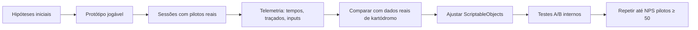

# 04 — Física de Pilotagem (Driving Physics)

## Objetivo e Escopo

Especificar o modelo de física simcade autêntico, parâmetros por categoria, comportamentos esperados e estratégia de calibração. Todos os valores numéricos são **hipóteses de calibração** até validação com telemetria e feedback de pilotos reais.

---

## Classificação: Simcade Autêntico

O modelo prioriza fundamentos reais de kart rental com assistências progressivas para tela touch. Não é simulação certificada nem arcade puro.

---

## Comportamentos Fundamentais

### Eixo Traseiro Rígido

- Kart rental não possui diferencial; eixo traseiro é sólido.
- Para curvar, o piloto deve aliviar a roda traseira interna via transferência de peso.
- Esterço excessivo sem alívio de peso "amarra" o kart, reduzindo velocidade.

### Transferência de Peso

| Ação | Efeito |
|---|---|
| Frenagem | Peso transfere para frente; traseira alivia |
| Entrada de curva | Peso transfere para exterior |
| Aceleração | Peso transfere para trás; frente alivia |
| Esterço + freio | Sobre-esterço possível; risco de rodada |

### Frenagem

- Freio predominantemente traseiro (rental).
- Frenagem em reta é mais eficiente que com esterço.
- Freio com esterço pode provocar sobre-esterço.
- Placas de frenagem (50/30/10) servem de referência na Escola.

### Superfícies

| Superfície | Aderência Relativa | Notas |
|---|---|---|
| Asfalto seco | 1.0 (referência) | — |
| Asfalto molhado | 0.6–0.7 | Hipótese de calibração |
| Zebra (curb) | 0.7–0.9 + instabilidade | Depende de altura, ângulo, velocidade |
| Grama | 0.4–0.5 | Desacelera rapidamente |
| Sujeira/cascalho | 0.3–0.4 | Desacelera + desvio |

### Colisões

| Tipo | Velocidade Relativa | Consequência |
|---|---|---|
| Leve (bumping) | < 5 km/h (hipótese) | Perda de velocidade, sem penalidade |
| Moderada | 5–10 km/h | Perda de velocidade + possível investigação |
| Grave | > 10 km/h | Recuperação segura + penalidade |

### Vácuo (Slipstream)

- **Distância de ativação:** ≤ 1,5 comprimentos de kart
- **Alinhamento:** Dentro de ±15° do eixo longitudinal do kart da frente
- **Tempo mínimo:** 1 s contínuo para início do efeito
- **Redução de arrasto:** Até 8% progressivamente
- **Visual:** Partículas sutis / distorção de ar
- **Não é:** Nitro, boost instantâneo ou power-up

---

## Parâmetros por Categoria (ScriptableObjects)

| Parâmetro | Escola (6,5 HP) | Rental (9 HP) | Rental Sport (13 HP) | Rental Pro (18 HP) |
|---|---|---|---|---|
| Potência (HP) | 6,5 | 9 | 13 | 18 |
| Velocidade máxima (km/h) | 55 | 70 | 85 | 100 |
| Aceleração 0→max (s) | 8,0 | 6,5 | 5,0 | 4,0 |
| Distância de frenagem (m @ max) | 12 | 18 | 25 | 33 |
| Aderência lateral (g) | 1,0 | 1,1 | 1,2 | 1,3 |
| Inércia rotacional | Baixa | Média | Média-Alta | Alta |
| Tolerância a erro | Alta | Média | Baixa | Muito Baixa |
| Sensibilidade ao esterço | Baixa | Média | Alta | Muito Alta |

> ⚠️ Todos os valores são hipóteses de calibração. Validação com telemetria no milestone 3.

---

## Modelo de Pneu Simplificado

- Curva de aderência vs ângulo de deslizamento (slip angle).
- Pico de aderência seguido de queda progressiva (não abrupta).
- Sem modelagem de temperatura/desgaste no MVP.
- Pneus "frios" como feature flag futura.

---

## Estratégia de Calibração

### Dados de Referência

- Tempos por volta de kartódromos públicos (Brasília).
- Vídeos onboard com telemetria de apps como RaceChrono.
- Feedback qualitativo de pilotos do campeonato do fundador.

---

## Requisitos Não Funcionais

| Requisito | Meta |
|---|---|
| Determinismo | Mesma entrada → mesma saída (para replay/validação) |
| Fixed timestep | 0,02 s (50 Hz) — hipótese |
| Performance | Física não deve exceder 3 ms/frame em dispositivo modesto |
| Parâmetros | 100% em ScriptableObjects; zero hardcoded |
| Testabilidade | Testes automatizados de física com tolerância definida |

---

## Casos de Borda

- Kart preso em barreira: detectar imobilidade > 4 s → recuperação automática.
- Kart voando (bug de colisão): detectar altura > 2 m → reset de posição.
- Kart invertido: detectar ângulo > 85° → reset.
- Lag spike em multiplayer: predição mantém física local; reconcilia ao receber estado.

### Recuperação segura do jogador

O recovery do jogador só é monitorado depois que a entrada da corrida está habilitada. Ele é acionado exclusivamente por imobilidade, inversão, saída do perímetro recuperável ou risco de segurança; um evento de colisão, independentemente da severidade, nunca é gatilho direto.

Ao recuperar, o kart volta ao ponto configurado mais próximo, alinhado à racing line, com velocidades linear e angular zeradas. Por 3 segundos, colisões com outros karts são ignoradas para evitar uma nova ejeção imediata; colisões com piso e pista permanecem ativas. A proteção é sempre restaurada ao expirar ou quando o componente é desabilitado/destruído.

Os valores iniciais abaixo são hipóteses calibráveis no `TrackConfigurationSO`:

| Parâmetro | Valor inicial |
|---|---:|
| Imobilidade contínua | > 4 s |
| Velocidade considerada imóvel | ≤ 0,2 m/s |
| Inclinação invertida | > 85° |
| Altura de risco sobre o recovery | > 2 m |
| Distância recuperável da racing line | 3 × largura da pista, mínimo 10 m |
| Proteção kart-contra-kart | 3 s |

---

## Decisões Confirmadas

1. Simcade autêntico, não sim pura nem arcade.
2. Eixo traseiro rígido como fundamento do modelo.
3. Parâmetros em ScriptableObjects por categoria.
4. Fixed timestep para determinismo.
5. Sem temperatura de pneu no MVP.

## Suposições

| ID | Suposição | Validação |
|---|---|---|
| PH-01 | 50 Hz é suficiente para colisões de kart | Testes com 100 Hz; comparar estabilidade |
| PH-02 | Modelo de pneu simplificado é divertido e autêntico | NPS pilotos reais |
| PH-03 | 8% de redução de arrasto no vácuo é perceptível mas não OP | Telemetria de ultrapassagens |

## Questões Abertas

- ~~Q-PH-01: Usar PhysX interno ou física custom para determinismo em rede?~~ → **RESOLVIDO** — Ver decisão abaixo.
- Q-PH-02: Quanto de assistência de frenagem mínima para casual sem estragar para hardcore?
- Q-PH-03: Peso do piloto deve ser considerado? Se sim, como equalizar justamente?

---

## Decisão Aprovada: PhysX + Camada Custom de Dinâmica (Q-PH-01)

**Status:** ✅ RESOLVIDO

**Decisão:** Usar Unity PhysX com Rigidbody para integração, colisões e contatos, combinado com uma camada custom C# de dinâmica de kart.

### O que NÃO fazer no MVP
- **Não** criar um motor de física completo do zero.
- **Não** depender exclusivamente de WheelCollider (limitado demais para simcade de kart rental).
- **Não** afirmar determinismo bit-perfect entre diferentes arquiteturas/OS/dispositivos.

### O que a camada custom DEVE modelar
- Eixo traseiro rígido
- Lift-off da roda traseira interna em curva
- Forças longitudinais e laterais
- Perda de velocidade por esterço excessivo
- Transferência de peso
- Frenagem predominantemente traseira
- Sobre-esterço sob frenagem com esterço
- Grip por tipo de superfície (asfalto, zebra, grama, sujeira)
- Efeito de curbs (zebras)
- Slipstream (vácuo)
- Diferenciação entre categorias: 6,5 HP, 9 HP, 13 HP e 18 HP

### Parâmetros e Calibração
- Todos os parâmetros em ScriptableObjects.
- Tratados como **hipóteses de calibração**, não como valores certificados.
- Fixed Timestep obrigatório (hipótese: 50 Hz / 0,02 s).
- Testes com tolerâncias definidas (posição ±0,01 m, velocidade ±0,1 km/h após 1000 ticks).

### Determinismo e Rede
- Usar Fixed Timestep para reprodutibilidade dentro de uma mesma plataforma.
- **Não** prometer determinismo cross-platform/cross-device.
- Photon Fusion Shared Mode aprovado **apenas** para: protótipo, alpha privado e partidas sem prêmio.
- **Migração obrigatória** para server authority (Host Mode validado ou servidor dedicado) **antes de**: ranked competitivo, campeonatos com prêmio, resultados oficiais, economia significativa ou matches públicos de alta competitividade.
- Tempos, moedas, inventário, resultados e recompensas **não devem depender exclusivamente do client**.

## Links Relacionados

- [Controles](./05-controls-accessibility.md)
- [Bots](./07-ai-bots.md)
- [Multiplayer](./08-multiplayer-architecture.md)
- [Teste de Física](./16-test-strategy.md)
- [Protótipo M2-T01](./29-kart-dynamics-prototype.md)

## Evidência inicial da M2-T01

Em 2026-08-18, a primeira camada custom de dinâmica foi validada no Galaxy S25. O protótipo usa Rigidbody/PhysX para contato e uma camada C# em `FixedUpdate` de 50 Hz para forças longitudinais e laterais, aderência progressiva, transferência de peso, lift-off da roda traseira interna, coasting, drag e perda de velocidade por esterço.

O fundador confirmou aceleração e frenagem funcionais, curvas previsíveis, passagem pelos obstáculos, direção adequada e ré técnica limitada a 12 km/h. Os valores permanecem hipóteses de calibração; esta aprovação confirma somente a fundação da M2-T01, não os modelos detalhados das tarefas seguintes.
