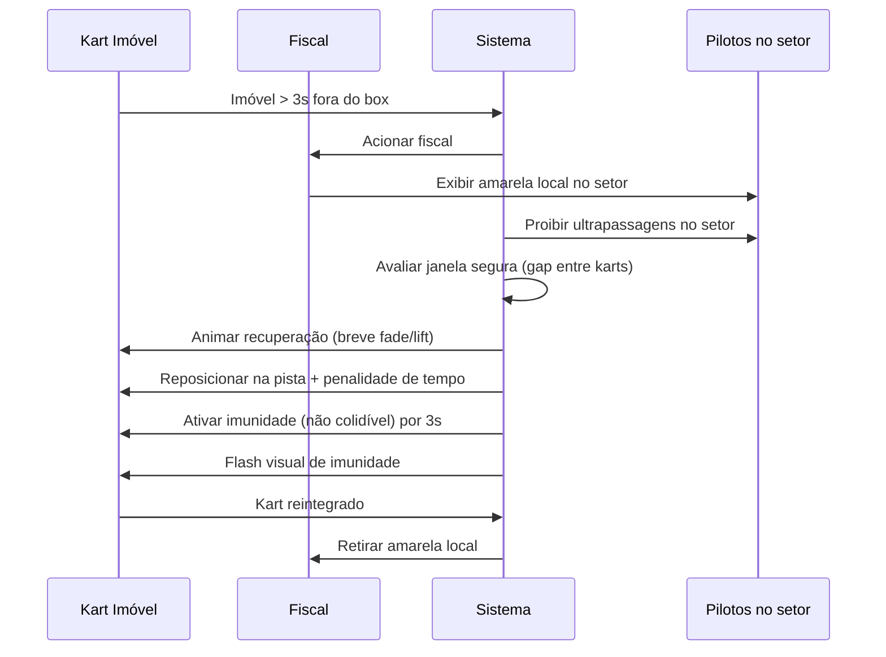
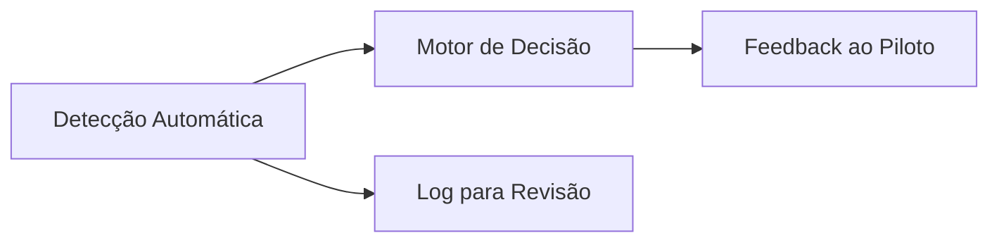

# 06 — Regras, Bandeiras e Fiscais

## Objetivo e Escopo

Definir o regulamento esportivo do jogo, bandeiras, penalidades, protocolo de recuperação e subsistema de Direção de Prova. A fonte de verdade regulamentar será definida no ADR-0006.

---

## Bandeiras

| Bandeira | Cor/Símbolo | Significado | Ação do Piloto |
|---|---|---|---|
| Verde | 🟢 | Pista liberada / início de sessão | Corrida normal |
| Amarela Local | 🟡 | Perigo no setor; reduzir velocidade | Não ultrapassar no setor |
| Vermelha | 🔴 | Sessão interrompida | Parar com segurança |
| Azul | 🔵 | Prestes a levar volta | Facilitar passagem |
| Branca | ⚪ | Veículo lento no setor | Atenção extra |
| Preta | ⚫ | Entrar nos boxes / desclassificação | Retornar ao box em 1 volta |
| Quadriculada | 🏁 | Fim da sessão | Completar volta e desacelerar |

---

## Penalidades

| Infração | Detecção | Penalidade Padrão | Notas |
|---|---|---|---|
| Queima de largada | Automática (aceleração antes de lights-out) | +3 s no tempo final | Hipótese de calibração |
| Ultrapassagem sob amarela | Automática (posição no setor + flag ativa) | +3 s | — |
| Corte de pista com ganho | Automática (checkpoint + delta) | Invalidar tempo do setor ou +tempo | — |
| Contato evitável | Semi-automática (velocidade relativa + direção) | Warning → +3 s na reincidência | — |
| Empurrão reiterado | Automática (3+ contatos em 30 s) | +5 s ou drive-through | Hipótese |
| Ignorar azul | Automática (não ceder em 3 flags azuis) | +5 s | — |
| Direção contrária | Automática (heading vs track direction) | Bandeira preta imediata | — |
| Abandono frequente | Backend (3+ abandonos em 24 h) | Cooldown de matchmaking 15 min | — |

---

## Protocolo de Recuperação Segura

---

## Subsistemas da Direção de Prova

1. **Detecção Automática**: Sensores de checkpoint, velocidade relativa, heading, posição, flag state.
2. **Motor de Decisão**: Aplica regras parametrizáveis conforme ADR-0006. Colisões ambíguas não geram penalidade automática.
3. **Feedback ao Piloto**: HUD de flag, notificação de penalidade, tempo adicionado visível.
4. **Log para Revisão**: Telemetria de cada incidente para análise offline (campeonatos privados).

---

## Colisões Ambíguas

Critérios para classificar colisão como ambígua (não penalizar automaticamente):

- Velocidade relativa entre 5–10 km/h (zona cinza).
- Ambos os karts em trajetória convergente (racing incident).
- Contato iniciado por kart do lado de fora sem ganho óbvio.

Registrar evento com telemetria completa; resolução humana em campeonatos com prêmio.

---

## Parametrização

Todas as regras devem ser configuráveis via Remote Config:

- Tempos de penalidade.
- Thresholds de velocidade para colisão.
- Número de flags azuis antes de penalidade.
- Duração da imunidade pós-recuperação.
- Cooldown de abandono.

---

## Requisitos Não Funcionais

| Requisito | Meta |
|---|---|
| Latência de detecção | < 100 ms após evento |
| Falso positivo | < 5% em colisões (validar no alpha) |
| Feedback visual | < 200 ms após decisão |

---

## Decisões Confirmadas

1. 7 bandeiras no MVP.
2. Recuperação segura com imunidade temporária.
3. Separação detecção / decisão / feedback.
4. Colisões ambíguas não penalizadas automaticamente.
5. Regras parametrizáveis via Remote Config.

## Suposições

| ID | Suposição | Validação |
|---|---|---|
| RF-01 | +3 s é penalidade equilibrada para infrações leves | Feedback pilotos alpha |
| RF-02 | 3 s de imunidade pós-reset é suficiente para retomar velocidade | Telemetria de velocidade no reset |
| RF-03 | Detecção automática de corte de pista funciona com checkpoints simples | Testes com variantes de traçado |

## Questões Abertas

- Q-RF-01: Implementar sistema de apelação para campeonatos privados?
- Q-RF-02: Azul deve ser obrigatória ou apenas informativa no MVP?
- Q-RF-03: Penalidade de abandono deve afetar ranking ou apenas cooldown?

## Links Relacionados

- [ADR Regras Esportivas](./adr/0006-source-of-sporting-rules.md)
- [Bots](./07-ai-bots.md)
- [Multiplayer](./08-multiplayer-architecture.md)
- [Progressão](./10-progression-economy.md)
