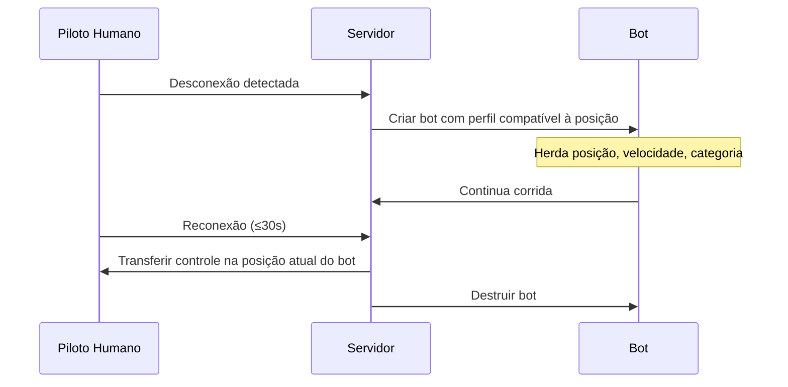

# 07 — Bots (Inteligência Artificial)

## Objetivo e Escopo

Especificar comportamento, perfis, limitações e integração dos Bots no sistema de corrida para garantir partidas preenchidas e desafiadoras em todos os modos.

---

## Princípios de Design

1. **Mesma física** — Bots usam o mesmo motor de física que humanos; sem modificadores ocultos.
2. **Humanização** — Erros controlados simulam variabilidade humana.
3. **Fair play** — Bots respeitam todas as regras e bandeiras.
4. **Escalabilidade** — Dificuldade escalona por perfil e contexto da sala.

---

## Perfis de Bot

| Perfil | Consistência | Ponto de Frenagem | Traçado | Defesa | Vácuo | Erros |
|---|---|---|---|---|---|---|
| Iniciante | Baixa | Muito cedo | Impreciso | Não defende | Não usa | Frequentes |
| Cauteloso | Média-Baixa | Cedo | Razoável | Cede facilmente | Raramente | Ocasionais |
| Equilibrado | Média | Adequado | Bom | Moderada | Usa | Raros |
| Agressivo Limpo | Alta | Tardio | Ótimo | Forte mas limpa | Busca ativamente | Mínimos |
| Rápido | Muito Alta | Limite | Quase ideal | Posicional | Otimiza | Quase nenhum |

---

## Comportamentos Detalhados

### Navegação

- Seguir waypoints com spline cúbica por setor.
- Variação lateral dentro de tolerância do perfil (simula diferentes linhas).
- Respeitar limites de pista; desviar de obstáculos e karts parados.

### Frenagem

- Calcular ponto de frenagem baseado em velocidade + perfil.
- Adicionar variação aleatória controlada (±N metros conforme perfil).
- Não usar frenagem "perfeita" impossível para humano.

### Ultrapassagem

- Avaliar gap lateral e velocidade relativa.
- Só ultrapassar quando houver espaço seguro.
- Perfil agressivo aproveita vácuo + saída de curva.
- Não colidir intencionalmente.

### Defesa

- Mudar de linha uma vez por reta (regra anti-bloqueio).
- Não fazer zigue-zague.
- Perfil cauteloso/iniciante cede espaço.
- Perfil agressivo posiciona-se na linha ideal; cede se overlap.

### Respeito a Regras

- Respeitar amarela (desacelerar, não ultrapassar no setor).
- Ceder quando receber azul (conforme perfil; cauteloso cede rápido, rápido cede no último momento legal).
- Nunca andar em direção contrária.
- Aceitar penalidade se aplicável (mesmo fluxo do humano).

---

## Substituição de Desconectado

### Determinação de Perfil na Substituição

- Posição 1–3: Perfil "Rápido"
- Posição 4–6: Perfil "Equilibrado"
- Posição 7–10: Perfil "Cauteloso"

Ajustado pelo histórico de habilidade do piloto desconectado quando disponível.

---

## Erros Humanos Controlados

| Tipo de Erro | Perfil que Comete | Frequência | Magnitude |
|---|---|---|---|
| Frenagem tardia (overbraking) | Iniciante, Cauteloso | 1/3 voltas | Perda de 0,3–0,8 s |
| Ápice perdido | Iniciante | 1/2 voltas | Perda de 0,2–0,5 s |
| Aceleração antecipada (spin leve) | Iniciante | 1/5 voltas | Perda de 0,5–1,0 s |
| Hesitação na defesa | Cauteloso | Sempre que defendido | Perda de posição |
| Nenhum erro significativo | Rápido | — | Tempos consistentes |

> ⚠️ Frequências e magnitudes são hipóteses de calibração.

---

## Integração com Matchmaking

- Bots completam vagas quando humanos < máximo da sala.
- Perfis selecionados para equilibrar a dificuldade média da sala.
- Em Partida Rápida: mistura de perfis com bias para o nível dos humanos presentes.
- Em Sala Privada: host pode escolher dificuldade dos bots (iniciante/médio/difícil).

---

## Requisitos Não Funcionais

| Requisito | Meta |
|---|---|
| CPU por bot | < 0,5 ms/frame (10 bots = < 5 ms total) |
| Memória por bot | < 2 MB |
| Previsibilidade | Determinístico dado seed (para replay) |
| Escalabilidade | Até 9 bots simultâneos em dispositivo modesto |

---

## Casos de Borda

- Todos humanos desconectam → Sessão encerra após 30 s; resultados parciais.
- Bot fica preso → Mesma recuperação segura que humano.
- Bot recebe penalidade → Aplica normalmente (credibilidade).
- Sala privada sem bots por escolha do host → Corrida com menos participantes.

---

## Decisões Confirmadas

1. Mesma física para bots e humanos; sem cheats.
2. 5 perfis de dificuldade.
3. Erros humanos parametrizados por perfil.
4. Substituição de desconectado por bot com retomada.
5. Host de sala privada controla dificuldade de bots.

## Suposições

| ID | Suposição | Validação |
|---|---|---|
| AI-01 | Waypoints + spline cúbica é suficiente sem ML | Qualidade de traçado vs humanos no alpha |
| AI-02 | 5 perfis cobrem todas as necessidades do MVP | Feedback de variedade nas corridas |
| AI-03 | 0,5 ms/frame por bot é alcançável | Profiling no milestone 4 |

## Questões Abertas

- Q-AI-01: Bots devem ter nomes e avatares persistentes para parecerem humanos?
- Q-AI-02: Usar ML para perfis mais avançados pós-MVP?
- Q-AI-03: Bot deve comunicar via chat/emotes?

## Links Relacionados

- [Física](./04-driving-physics.md)
- [Regras](./06-race-rules-flags.md)
- [Multiplayer](./08-multiplayer-architecture.md)
