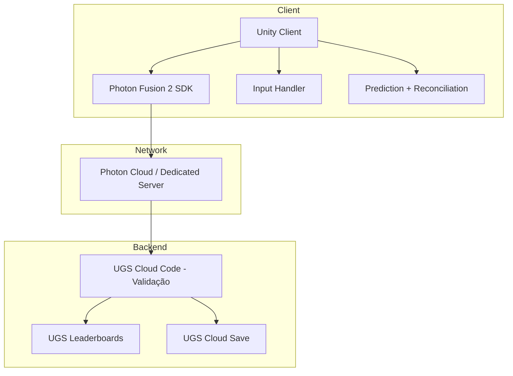
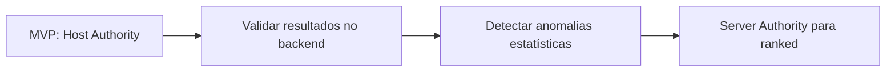
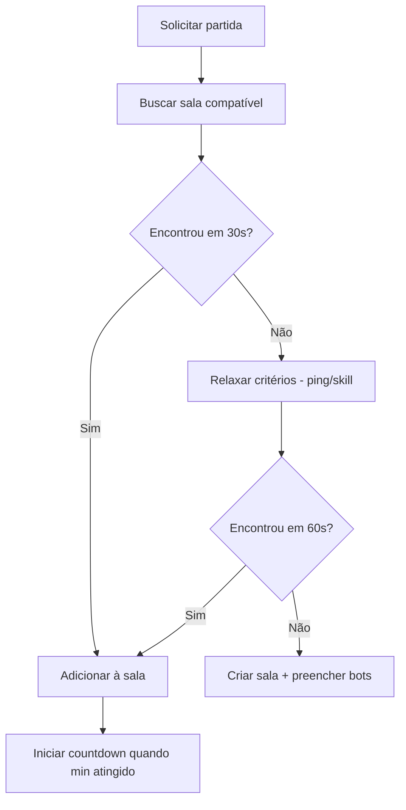

# 08 — Arquitetura Multiplayer

## Objetivo e Escopo

Definir modelo de autoridade, transporte, sincronização, lag compensation, anti-cheat e infraestrutura de rede para corridas online.

---

## Visão Geral da Arquitetura

---

## Modelo de Autoridade

### MVP — Host Autoritativo (Shared Mode)

- Host = primeiro jogador a criar a sala.
- Host valida posições, colisões e resultados.
- Clientes enviam inputs; recebem estado corrigido.
- Vantagem: menor custo; funciona para salas privadas entre amigos.
- Risco: host pode trapacear; aceitável no MVP entre amigos.

### Pós-MVP — Servidor Autoritativo (Server Mode)

- Dedicated server Photon ou custom.
- Servidor valida toda a simulação de física.
- Clientes são puramente preditivos.
- Necessário para ranked com prêmios.
- Custo: maior; requer infraestrutura dedicada.

### Caminho de Migração

---

## Transporte e Tick Rate

| Parâmetro | Valor (hipótese) | Justificativa |
|---|---|---|
| Protocolo | UDP (Photon reliable/unreliable mix) | Latência mínima |
| Tick Rate | 30 Hz | Equilíbrio custo/precisão para kart |
| Send Rate (cliente → server) | 30 Hz | 1:1 com tick |
| Interpolação | Buffer de 100 ms (3 ticks) | Suavidade visual |
| Predição | Input-based client-side | Responsividade local |

> ⚠️ Tick rate pode aumentar para 60 Hz se testes revelarem colisões imprecisas a 30 Hz.

---

## Sincronização de Estado

### Dados Sincronizados por Tick

| Dado | Tamanho Estimado | Método |
|---|---|---|
| Posição (Vector3) | 12 bytes | Unreliable, quantizado |
| Rotação (Quaternion comprimido) | 4 bytes | Unreliable |
| Velocidade (Vector3) | 12 bytes | Unreliable |
| Input (steering + throttle + brake) | 3 bytes | Unreliable |
| Estado (flags, penalidades) | 2 bytes | Reliable |

### Bandwidth Estimado (10 jogadores, 30 Hz)

- Por jogador enviando: ~33 bytes × 30 = ~1 KB/s
- Por jogador recebendo (9 outros): ~9 KB/s
- Total por jogador: ~10 KB/s
- Aceitável para 4G/LTE brasileiro.

---

## Lag Compensation

- **Corridas de kart** têm velocidades relativamente baixas (55–100 km/h) comparadas a FPS.
- Predição de posição linear com correção suave (snap threshold configurable).
- Não usar rollback para colisões — aceitar que colisões leves podem ter 1–2 ticks de imprecisão.
- Colisões graves confirmadas pelo host antes de penalidade.

---

## Reconexão

| Cenário | Comportamento |
|---|---|
| Desconexão < 5 s | Predição local mantém estado; reconcilia ao reconectar |
| Desconexão 5–30 s | Bot assume; piloto retoma ao reconectar |
| Desconexão > 30 s | Resultado parcial; posição final = posição no momento da queda |
| Falha de host (host migration) | Photon Fusion elege novo host; resync state |

---

## Matchmaking

### Critérios (ponderados)

| Critério | Peso | Descrição |
|---|---|---|
| Categoria | Obrigatório | Mesma categoria de kart |
| Habilidade (ELO/MMR) | Alto | ±200 pontos (hipótese) |
| Ping | Médio | Priorizar < 80 ms |
| Índice Pilotagem Limpa | Baixo | Agrupar fair players |
| Região | Obrigatório | Brasil (São Paulo) primariamente |

### Fluxo

---

## Anti-Cheat (MVP)

| Ameaça | Detecção | Mitigação |
|---|---|---|
| Speed hack | Velocidade > máx. física por 3+ ticks | Correção autoritativa + flag |
| Teleport | Delta posição impossível entre ticks | Rejeitar estado + flag |
| Alteração de tempo | Server time authority | Resultados validados por timestamp do servidor |
| Moeda/inventário | Backend authority (UGS) | Client nunca modifica diretamente |
| Resultado falso | Backend valida posição final | Cross-check com telemetria do host |

### Anti-Cheat Pós-MVP

- Replay/telemetria para investigação manual em ranked.
- Detecção estatística de anomalias (tempos impossíveis por categoria).
- Banimento por reputação.

---

## Infraestrutura de Rede

| Componente | Região | Serviço |
|---|---|---|
| Relay/Host | São Paulo (BR) | Photon Cloud |
| Backend | São Paulo / Global | UGS |
| Matchmaking | Global | Photon Matchmaking |
| Fallback | US-East | Se BR indisponível |

---

## Requisitos Não Funcionais

| Requisito | Meta |
|---|---|
| Latência P50 (BR) | < 50 ms |
| Latência P95 (BR) | < 100 ms |
| Packet loss tolerável | < 5% sem degradação visível |
| Reconexão | < 5 s para retomada transparente |
| CCU MVP | 100 simultâneos |
| CCU Soft Launch | 1.000 simultâneos |

---

## Decisões Confirmadas

1. Photon Fusion 2 como camada de transporte.
2. MVP com host authority (Shared Mode).
3. Servidor autoritativo para ranked pós-MVP.
4. Tick rate inicial de 30 Hz.
5. Região primária: São Paulo.
6. Resultados validados em backend.

## Suposições

| ID | Suposição | Validação |
|---|---|---|
| MP-01 | 30 Hz é suficiente para colisões de kart a 100 km/h | Testes no milestone 5 |
| MP-02 | Host authority entre amigos é aceitável no MVP | Feedback do alpha |
| MP-03 | Bandwidth de 10 KB/s é viável em 4G BR | Testes de campo com pilotos |
| MP-04 | Photon Cloud São Paulo tem latência < 50 ms | Benchmark antes de commit |

## Questões Abertas

- ~~Q-MP-01: Usar Photon Shared ou Server Mode desde o início?~~ → **RESOLVIDO** — Ver decisão abaixo.
- Q-MP-02: Custo mensal estimado para 1.000 CCU no Photon?
- Q-MP-03: Custom dedicated server vs Photon Server para ranked?
- Q-MP-04: Voice chat futuro? Qual SDK?

---

## Decisão Aprovada: Shared Mode com Migração Explícita (Q-MP-01)

**Status:** ✅ RESOLVIDO

**Decisão:** Photon Fusion Shared Mode aprovado **exclusivamente** para:
- Protótipo (M2–M4)
- Alpha privado com amigos (M8)
- Partidas sem prêmio (salas privadas, partida rápida casual)

### Limitações do Shared Mode
- Host pode manipular estado → aceitável apenas entre amigos/casual.
- Resultados validados em backend mitigam parcialmente, mas não eliminam risco.
- **Não adequado** para ranked competitivo, campeonatos com prêmio ou economia significativa.

### Caminho de Migração Obrigatório

O design DEVE incluir migração explícita para server authority **antes de** ativar qualquer dos seguintes:
1. Ranked competitivo com divisões
2. Campeonatos com prêmios (cosméticos ou financeiros)
3. Resultados oficiais publicados
4. Economia significativa dependente de resultados de corrida
5. Matches públicos de alta competitividade

### Opções de Migração (a decidir em M10)
- **Photon Fusion Host Mode validado**: Host executa simulação, backend valida resultado com telemetria cross-check.
- **Photon Fusion Server Mode**: Dedicated server Photon executa simulação completa.
- **Custom dedicated server**: Controle total; maior custo de desenvolvimento.

### Validação Backend (obrigatória desde M5)
- Tempos, moedas, inventário, resultados e recompensas **nunca** dependem exclusivamente do client.
- Cloud Code valida resultados antes de persistir.
- Detecção estatística de anomalias desde o alpha.

## Links Relacionados

- [ADR Networking](./adr/0002-networking.md)
- [Backend](./09-backend-data-model.md)
- [Segurança](./14-security-privacy-compliance.md)
- [Bots](./07-ai-bots.md)
