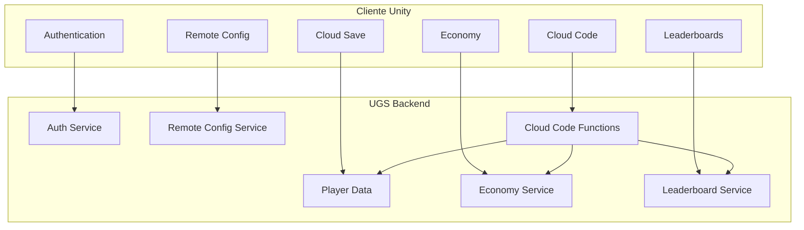

# 09 — Backend e Data Model

## Objetivo e Escopo

Definir serviços de backend, modelo de dados, integrações e políticas de persistência usando Unity Gaming Services (UGS) como plataforma primária.

---

## Arquitetura de Serviços



---

## Serviços Utilizados (UGS)

| Serviço | Uso | Dados |
|---|---|---|
| Authentication | Login, identidade | Player ID, providers |
| Player Names | Display name | Nome visível |
| Cloud Save | Progressão, configurações | Ver modelo abaixo |
| Economy | Moedas, inventário, compras | Currencies, items |
| Leaderboards | Rankings | Tempo por volta, pontos |
| Remote Config | Feature flags, parâmetros | Valores dinâmicos |
| Cloud Code | Validação server-side | Funções JS/C# |

---

## Modelo de Dados

### Player Profile (Cloud Save)

```json
{
  "playerId": "string (UGS Player ID)",
  "displayName": "string",
  "createdAt": "ISO 8601",
  "lastLogin": "ISO 8601",
  "licenses": {
    "escola": true,
    "rental": false,
    "rentalSport": false,
    "rentalPro": false
  },
  "xp": 0,
  "level": 1,
  "cleanDrivingIndex": 100,
  "settings": {
    "controlMode": "joystick|wheel|tilt",
    "controlLayout": { "positions": {}, "sizes": {} },
    "hapticEnabled": true,
    "hapticTypes": {},
    "assists": { "steering": "light", "braking": "light", "idealLine": "curves" },
    "graphicsQuality": "auto|low|medium|high",
    "audioSettings": {}
  },
  "schoolProgress": {
    "completedModules": [1, 2, 3],
    "currentModule": 4,
    "bestTimes": {}
  },
  "stats": {
    "racesCompleted": 0,
    "racesWon": 0,
    "bestLapTimes": {},
    "totalDistance": 0,
    "totalRaceTime": 0,
    "podiums": 0,
    "penalties": 0
  }
}
```

### Economy (UGS Economy)

| Moeda/Item | Tipo | Fonte | Uso |
|---|---|---|---|
| Coins (grátis) | Virtual Currency | Corridas, escola, ads recompensados | Cosméticos básicos |
| Gems (premium) | Virtual Currency | IAP | Cosméticos premium, passe |
| Cosméticos | Inventory Items | Compra, progressão, passe | Equipar na garagem |
| Remove Ads | Inventory Item | IAP (one-time) | Flag permanente |

### Race Result (Cloud Code → Cloud Save)

```json
{
  "raceId": "UUID",
  "trackId": "string",
  "category": "escola|rental|rentalSport|rentalPro",
  "timestamp": "ISO 8601",
  "players": [
    {
      "playerId": "string",
      "position": 1,
      "bestLap": 45.230,
      "totalTime": 480.100,
      "penalties": [{ "type": "string", "seconds": 3 }],
      "xpEarned": 120,
      "cleanDrivingDelta": -2,
      "isBot": false
    }
  ],
  "validatedBy": "host|server",
  "serverTimestamp": "ISO 8601"
}
```

### Leaderboard Entries

| Leaderboard | Chave | Valor | Reset |
|---|---|---|---|
| Best Lap (por pista/categoria) | playerId | Tempo (ms) | Nunca |
| Season Ranking | playerId | Pontos | Por temporada |
| Clean Driving | playerId | Índice | Semanal |
| Championship (privado) | playerId | Pontos acumulados | Por campeonato |

---

## Cloud Code Functions

| Função | Trigger | Responsabilidade |
|---|---|---|
| `validateRaceResult` | Fim de corrida | Validar resultado, calcular XP, atualizar economia |
| `processIAP` | Compra confirmada | Verificar receipt, conceder item, log |
| `calculateMatchmaking` | Solicitação de partida | Pontuar jogadores compatíveis |
| `resetSeason` | Cron (início de temporada) | Resetar rankings, distribuir rewards |
| `checkAbandonCooldown` | Solicitação de partida | Verificar se piloto está em cooldown |

---

## Integrações Externas

| Serviço | Uso | Dados Enviados |
|---|---|---|
| Google Play Billing | IAP Android | Receipt para validação |
| Apple StoreKit 2 | IAP iOS | Receipt para validação |
| AdMob | Ads | Ad unit IDs, impressões |
| Firebase Crashlytics | Crash reporting | Stack traces, device info |
| Unity Analytics | Telemetria | Eventos customizados |

---

## Requisitos Não Funcionais

| Requisito | Meta |
|---|---|
| Disponibilidade | 99,5% (SLA do UGS) |
| Latência de leitura (Cloud Save) | < 200 ms P95 |
| Latência de escrita (resultado) | < 500 ms P95 |
| Consistência | Eventual consistency aceitável para perfil; strong para economia |
| Backup | UGS gerencia; reconciliação local em caso de conflito |

---

## Casos de Borda

- Cloud Save offline: persistir localmente; sync ao reconectar com merge strategy (last-write-wins para settings; server-wins para economia).
- Receipt inválido: rejeitar compra; logar para investigação.
- Conflito de moeda: backend é source of truth; client nunca incrementa diretamente.
- Player name ofensivo: filtro de palavras + report manual.

---

## Decisões Confirmadas

1. UGS como backend primário (Auth, Cloud Save, Economy, Leaderboards, Remote Config, Cloud Code).
2. Economia validada server-side via Cloud Code.
3. Resultados de corrida validados antes de persistir.
4. Client nunca modifica moeda/inventário diretamente.
5. Receipt validation para todas as compras.

## Suposições

| ID | Suposição | Validação |
|---|---|---|
| BD-01 | UGS suporta volume do MVP (< 10 K DAU) sem custos proibitivos | Verificar pricing UGS |
| BD-02 | Cloud Code (JS) é suficiente para validação sem custom server | Benchmark de latência |
| BD-03 | Last-write-wins é aceitável para settings | Análise de conflitos no beta |

## Questões Abertas

- Q-BD-01: Limite de armazenamento Cloud Save por jogador no plano UGS?
- Q-BD-02: Migração de dados se trocar UGS por solução custom?
- Q-BD-03: GDPR/LGPD: procedimento para exclusão de dados no UGS?

## Links Relacionados

- [ADR Backend](./adr/0003-backend.md)
- [Multiplayer](./08-multiplayer-architecture.md)
- [Monetização](./11-monetization-liveops.md)
- [Segurança](./14-security-privacy-compliance.md)
