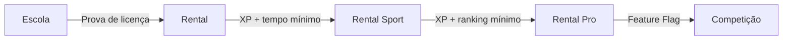
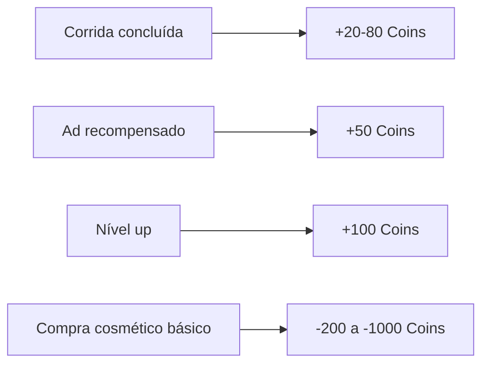

# 10 — Progressão e Economia

## Objetivo e Escopo

Definir sistemas de progressão esportiva, economia interna, equilíbrio de moedas e separação clara entre conquista e monetização.

---

## Princípio Fundamental

> A progressão esportiva é conquistada exclusivamente por desempenho e dedicação. Nenhum gasto financeiro concede vantagem competitiva.

---

## Progressão Esportiva

### Licenças

| Licença | Requisito | Categoria Desbloqueada |
|---|---|---|
| Escola | Concluir módulos 1–10 + prova | 6,5 HP |
| Rental | Licença Escola + 10 corridas + tempo ≤ threshold | 9 HP |
| Rental Sport | Licença Rental + 30 corridas + tempo ≤ threshold | 13 HP |
| Rental Pro | Licença Rental Sport + 50 corridas + top 30% ranking | 18 HP |

> ⚠️ Thresholds de tempo são hipóteses de calibração, definidos por pista/categoria.

### XP (Experiência)

| Fonte | XP Base | Multiplicador |
|---|---|---|
| Corrida concluída | 50 | — |
| Posição final (1º–10º) | 100–10 | Escalonado |
| Melhor volta pessoal | 30 | — |
| Pilotagem limpa (sem penalidades) | 40 | — |
| Módulo da Escola concluído | 60 | — |
| Prova de Licença aprovada | 200 | — |

### Níveis

- Nível = f(XP total).
- Curva de XP por nível: linear até nível 10, depois exponencial suave.
- Cada nível desbloqueia 1 recompensa cosmética (fixo, não aleatório).
- Nível máximo no MVP: 50 (hipótese).

### Índice de Pilotagem Limpa

| Fator | Impacto no Índice |
|---|---|
| Corrida sem penalidade | +2 |
| Penalidade leve | -5 |
| Penalidade grave | -15 |
| Abandono | -10 |
| Corrida limpa consecutiva (5+) | Bônus +5 |
| Decay natural (sem corrida por 7 dias) | -1/dia até mínimo 50 |

- Escala: 0–100 (inicia em 80).
- Influencia matchmaking (agrupa jogadores limpos).
- Exibido no perfil.
- Não bloqueia acesso a modos.

### Ranking e Divisões (Pós-MVP)

| Divisão | ELO Range | Recompensa de Temporada |
|---|---|---|
| Bronze | 0–999 | Moldura Bronze |
| Prata | 1000–1499 | Moldura Prata |
| Ouro | 1500–1999 | Moldura Ouro + cosmético exclusivo |
| Platina | 2000–2499 | Moldura Platina + cosmético |
| Diamante | 2500+ | Moldura Diamante + título |

---

## Economia Interna

### Moedas

| Moeda | Nome | Aquisição | Uso |
|---|---|---|---|
| Grátis | Coins | Corridas, escola, ads recompensados, nível up | Cosméticos básicos |
| Premium | Gems | IAP | Cosméticos premium, passe de temporada |

### Fluxo de Coins

### Guardrails de Inflação

- Definir sink/source ratio alvo: 0,8–1,2.
- Monitorar via telemetria: coins criados / coins gastos por dia.
- Ajustar preços via Remote Config se ratio > 1,5 por 7 dias.
- Coins não são convertíveis em Gems.
- Gems não são convertíveis em Coins.

---

## Recompensas por Progressão

| Milestone | Recompensa |
|---|---|
| Licença Escola | Capacete "Estudante" |
| Licença Rental | Pintura "First Timer" |
| Licença Rental Sport | Macacão "Intermediário" |
| Nível 10 | Adesivo exclusivo |
| Nível 25 | Comemoração de pódio |
| Nível 50 | Moldura "Veterano" |
| 100 corridas limpas | Título "Fair Racer" |
| Campeonato privado (1º) | Troféu de perfil |

---

## Requisitos Não Funcionais

| Requisito | Meta |
|---|---|
| Tempo para primeira compra significativa | 5–10 h de jogo (hipótese) |
| Progressão por sessão (20 min) | Pelo menos 1 unlock ou milestone visível |
| Nenhuma barreira de pagamento | Todo conteúdo gameplay acessível grátis com tempo |
| Economia server-authoritative | Client nunca incrementa moeda |

---

## Casos de Borda

- Piloto com 100% de abandonos: Índice cai a 0; matchmaking prioriza outros abandonistas.
- Piloto novo em Rental Sport mas sem habilidade: Perde corridas; matchmaking ajusta ELO para baixo.
- Inflação descontrolada: Remote Config reduz rewards e aumenta sinks.
- Duplicação de moeda (bug): Backend rejeita transações > earning rate máximo.

---

## Decisões Confirmadas

1. Progressão esportiva 100% conquistada; sem atalhos pagos.
2. Duas moedas: Coins (grátis) e Gems (premium).
3. Moedas não conversíveis entre si.
4. Índice de Pilotagem Limpa influencia matchmaking.
5. Recompensas por nível são fixas (não aleatórias).
6. Backend é source of truth para economia.

## Suposições

| ID | Suposição | Validação |
|---|---|---|
| PE-01 | 50 XP base por corrida gera progressão satisfatória | Simulação + telemetria D7 |
| PE-02 | Sink/source ratio 0,8–1,2 previne inflação | Monitoramento semanal |
| PE-03 | Nível 50 é atingível em ~100 h de jogo | Simulação de curva XP |

## Questões Abertas

- Q-PE-01: Coins devem ter cap máximo por dia (anti-farm)?
- Q-PE-02: Resetar ELO por temporada ou decair gradualmente?
- Q-PE-03: Recompensas de temporada devem ser exclusivas (FOMO) ou retornáveis?

## Links Relacionados

- [Monetização](./11-monetization-liveops.md)
- [Backend](./09-backend-data-model.md)
- [GDD](./02-game-design-document.md)
- [Analytics](./13-analytics-telemetry.md)
