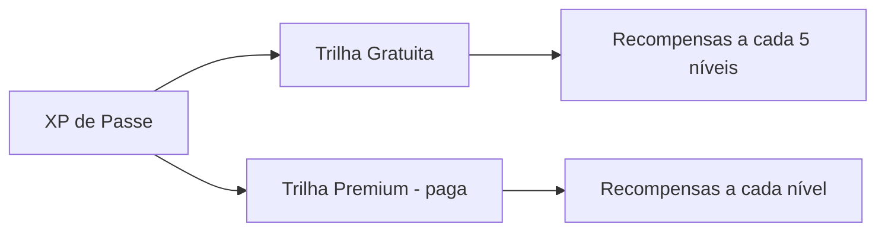

# 11 — Monetização e LiveOps

## Objetivo e Escopo

Definir fontes de receita, políticas éticas, passe de temporada, anúncios, LiveOps e controles de proteção ao jogador.

---

## Princípios Éticos

1. **Sem pay-to-win**: Nenhum item pago confere vantagem em multiplayer equalizado.
2. **Sem loot boxes pagas no MVP**: Itens comprados são determinísticos.
3. **Sem exploração de crianças**: Controles parentais, limites de gasto, linguagem não manipulativa.
4. **Transparência**: Preços reais sempre visíveis; sem dark patterns.
5. **Respeito ao tempo**: Jogador que não paga progride com dedicação.

---

## Fontes de Receita

| Fonte | Descrição | Prioridade |
|---|---|---|
| Remoção de Ads | Compra única; remove intersticiais e banners | MVP |
| Cosméticos diretos | Compra individual de itens na loja | MVP |
| Passe de Temporada | Trilha cosmética por tempo limitado | MVP (simples) |
| Anúncio recompensado | Opcional; bônus não-competitivo (Coins) | MVP |
| Anúncio intersticial | Em pausas naturais; com limite | MVP |
| Patrocínios in-game | Placas, banners na pista | Pós-MVP |
| Pistas licenciadas | DLC de kartódromos reais | Pós-MVP |

---

## Anúncios

### Políticas

| Regra | Valor |
|---|---|
| Nunca durante corrida/sessão ativa | Obrigatório |
| Intervalo mínimo entre intersticiais | 5 minutos |
| Máximo de intersticiais por sessão de jogo | 3 |
| Recompensado: bônus por visualização | +50 Coins (hipótese) |
| Recompensado: limite diário | 5 visualizações |
| Banner: localização | Apenas lobby e menus |
| Criança (< 13 anos): anúncios personalizados | Desabilitados |

### Remoção de Ads

- Compra única (IAP).
- Remove: intersticiais, banners e recompensados (mantém opção manual de recompensado se desejar).
- Permanente por conta.
- Restaurável entre dispositivos.

---

## Passe de Temporada

### Estrutura

| Aspecto | Valor |
|---|---|
| Duração | 30 dias (hipótese) |
| Níveis | 30 |
| Preço | R$ 19,90 (hipótese, tier regional) |
| XP de Passe por corrida | 100 |
| Trilha gratuita | 6 itens cosméticos |
| Trilha premium | 30 itens cosméticos |
| Catch-up: comprar níveis | Sim, após 15 dias |

### Conteúdo do Passe (Exemplo)

- Capacetes temáticos
- Pinturas de kart exclusivas da temporada
- Adesivos
- Moldura de perfil da temporada
- Comemoração de pódio exclusiva (nível 30)

### Regras Éticas do Passe

- Nenhum item confere vantagem competitiva.
- Jogador que não compra passe ainda ganha itens na trilha gratuita.
- Itens do passe podem retornar em temporadas futuras (sem FOMO extremo).
- XP de passe vem apenas de jogar; não de pagar.

---

## Loja de Cosméticos

### Categorias

| Categoria | Preço (Coins) | Preço (Gems) | Exemplos |
|---|---|---|---|
| Comum | 200–500 | 50–100 | Cores básicas, adesivos simples |
| Raro | 800–1500 | 150–300 | Padrões especiais, capacetes temáticos |
| Épico | — | 500–800 | Sets completos, comemorações |
| Lendário | — | 1000–1500 | Itens de temporada exclusivos |

### Rotação

- Loja rotativa diária com 4 itens em destaque.
- Todos os itens disponíveis permanentemente na seção "catálogo".
- Items do passe anterior disponíveis por Gems após 1 temporada.

---

## LiveOps

### Eventos Planejados (Pós-MVP)

| Evento | Frequência | Descrição |
|---|---|---|
| Weekend Cup | Semanal | Campeonato relâmpago com prêmios cosméticos |
| Time Trial Challenge | Quinzenal | Melhor volta da comunidade; top 100 ganha item |
| Nova Temporada | Mensal | Novo passe, novos itens, reset parcial |
| Community Vote | Bimestral | Jogadores votam no próximo cosmético |

### Remote Config para LiveOps

- Preços ajustáveis por região.
- Ofertas especiais ativadas por segmento (novos, retornantes).
- Feature flags para eventos.
- A/B testing de bundles.

---

## Proteção ao Jogador

| Proteção | Implementação |
|---|---|
| Limite de gasto mensal | Configurável; alerta em R$ 200 (hipótese) |
| Confirmação de compra | Double-confirm para > R$ 50 |
| Restauração de compras | Botão em configurações; validação via store |
| Reembolso | Política alinhada com Google Play e App Store |
| Controle parental | Restrição de IAP se idade < 18 (verificação por birth year) |
| Consentimento | Termos e política de privacidade antes do primeiro login |
| Sem manipulação | Sem timers artificiais de urgência; sem "última chance" falsa |

---

## Projeção de Receita (Hipótese)

| Métrica | Valor Estimado | Base |
|---|---|---|
| ARPDAU (ads) | R$ 0,08 | Benchmarks mobile BR |
| ARPDAU (IAP) | R$ 0,15 | Benchmarks casual-mid |
| Conversão IAP | 3–5% | Indústria mobile |
| Passe conversion | 8–12% dos DAU | Benchmark passe cosmético |

> ⚠️ Projeções são hipóteses; validar no soft launch com métricas reais.

---

## Decisões Confirmadas

1. Sem pay-to-win em nenhum modo competitivo.
2. Sem loot boxes pagas no MVP.
3. Anúncios apenas fora de corrida ativa.
4. Passe de temporada puramente cosmético.
5. Preços com tier regional (Brasil).
6. Restauração de compras obrigatória.

## Suposições

| ID | Suposição | Validação |
|---|---|---|
| MN-01 | R$ 19,90 é price point acessível para passe no BR | A/B test no soft launch |
| MN-02 | 5 ads recompensados/dia não cansa o jogador | Retenção D7 por grupo |
| MN-03 | ARPDAU de R$ 0,23 total é atingível com mix ads+IAP | Soft launch metrics |

## Questões Abertas

- Q-MN-01: Parceria com marcas de kart para patrocínio in-game?
- Q-MN-02: Bundles de boas-vindas para novos jogadores? Preço?
- Q-MN-03: Como precificar remoção de ads (R$ 14,90? R$ 29,90?)?
- Q-MN-04: Passe de temporada deve ter trilha "catch-up" ou só comprar níveis?

## Links Relacionados

- [Progressão](./10-progression-economy.md)
- [Backend](./09-backend-data-model.md)
- [Analytics](./13-analytics-telemetry.md)
- [Segurança](./14-security-privacy-compliance.md)
