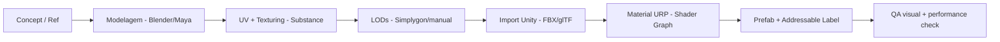

# 12 — Arte, Áudio e Performance

## Objetivo e Escopo

Definir direção visual, orçamentos de performance, pipeline de arte, sistema de áudio, háptica e metas técnicas por tier de dispositivo.

---

## Direção Visual

- **Estilo:** 3D semi-realista. Não fotorrealista; não cartoon.
- **Referência:** Kartódromos brasileiros (asfalto, barreiras de pneus, zebras, boxes, fiscais, placas de frenagem, paddock).
- **Proporções:** Autênticas de kart rental real.
- **Iluminação:** Baked + mixed. Realtime apenas para elementos dinâmicos essenciais.
- **Pistas fictícias:** Inspiradas em ambientes reais; sem reprodução de marcas ou traçados licenciados.

---

## Orçamentos de Performance

### Por Tier de Dispositivo

| Parâmetro | Baixo (Android modesto) | Médio | Alto |
|---|---|---|---|
| FPS alvo | 30 estável | 60 estável | 60 estável |
| Resolução | 720p | 1080p | 1440p ou nativa |
| Draw calls/frame | ≤ 100 | ≤ 200 | ≤ 350 |
| Triângulos/frame | ≤ 100 K | ≤ 300 K | ≤ 500 K |
| Texturas (VRAM) | ≤ 256 MB | ≤ 512 MB | ≤ 1 GB |
| RAM total app | ≤ 512 MB | ≤ 1 GB | ≤ 1,5 GB |
| CPU frame budget | ≤ 33 ms | ≤ 16 ms | ≤ 16 ms |
| GPU frame budget | ≤ 33 ms | ≤ 16 ms | ≤ 16 ms |
| Download (APK/IPA) | ≤ 150 MB | ≤ 150 MB | ≤ 150 MB |
| Addressables on-demand | ≤ 300 MB total | ≤ 500 MB | ≤ 700 MB |

### Budget por Entidade

| Entidade | Triângulos | Texturas | LODs |
|---|---|---|---|
| Kart (10 em pista) | 3.000–8.000 | 512×512–1024 | 3 níveis |
| Piloto | 1.500–4.000 | 512×512 | 2 níveis |
| Pista (total) | 50.000–200.000 | Atlas 2048 | Streaming por setor |
| Espectadores/fiscais | 200–500 cada | 256×256 shared | 1 nível |
| Barreiras/props | 100–1.000 | Atlas compartilhado | 2 níveis |

---

## Técnicas de Otimização

| Técnica | Aplicação |
|---|---|
| LODs | Karts, pilotos, props — 2–3 níveis |
| Occlusion Culling | Pista com setores + obstáculos fixos |
| Texture Atlases | Props, espectadores, ambiente |
| GPU Instancing | Barreiras, cones, árvores |
| Object Pooling | Partículas, FX, UI dinâmica |
| Baked Lighting | Iluminação ambiente + sombras estáticas |
| Addressables | Assets sob demanda; não no pacote base |
| Quality Auto-Detect | Ajuste no primeiro boot + ajuste dinâmico |
| Dynamic Resolution | Scale 70%–100% conforme GPU load |

---

## Perfis de Qualidade

| Configuração | Baixo | Médio | Alto |
|---|---|---|---|
| Sombras | Off | Low (baked) | Medium (realtime sun) |
| Pós-processamento | Nenhum | Bloom leve | Bloom + AO + DoF |
| Partículas | 50% | 100% | 150% |
| LOD Bias | Agressivo | Normal | Detalhado |
| Resolução | 70% | 100% | Nativa |
| Anti-aliasing | Nenhum | FXAA | SMAA |
| Reflections | Off | Baked | SSR básico |

---

## Áudio

### Motor

| Aspecto | Implementação |
|---|---|
| Resposta a RPM | Loop com pitch variável por RPM |
| Resposta a carga | Blend entre on-throttle e off-throttle |
| Desaceleração | Crossfade para engine braking sound |
| Múltiplos karts | Instâncias com atenuação por distância |

### Pneus e Superfícies

| Evento | Som | Notas |
|---|---|---|
| Derrapagem leve | Scrub sutil | Proporcional ao slip angle |
| Derrapagem forte | Squeal | Indica limite ultrapassado |
| Zebra | Rumble rítmico | Frequência proporcional à velocidade |
| Grama | Friction muffled | Acompanha redução de aderência |
| Contato kart-kart | Thump metálico | Proporcional à velocidade relativa |
| Barreira | Impact forte | Com reverb do ambiente |

### Ambiente e Corrida

| Elemento | Descrição |
|---|---|
| Vento | Volume cresce com velocidade |
| Bandeiras (sinalização) | Bip discreto no HUD |
| Largada (semáforo) | Bip por luz + horn no lights-out |
| Público | Murmúrio ambient; aplauso no pódio |
| Música | Lobby/menus apenas; silencia durante corrida (motor predomina) |

### Háptica

Detalhada no doc [05-controls-accessibility.md](./05-controls-accessibility.md). Configurável por tipo de evento.

---

## Pipeline de Arte

### Convenções de Assets

- Naming: `category_name_variant_LODn` (ex: `kart_base_red_LOD0`)
- Texturas: Power-of-2, max 2048 para pista, max 1024 para entidades
- Formatos: ASTC para mobile, ETC2 como fallback
- Animações: Humanoid rig para pilotos; Generic para karts

---

## Requisitos Não Funcionais

| Requisito | Meta |
|---|---|
| Cold start (app open → menu) | < 8 s em dispositivo médio |
| Loading de corrida | < 5 s em dispositivo médio |
| Frame drops (> 50 ms) | < 2% dos frames |
| Temperatura | Não exceder 42°C após 30 min (hipótese) |
| Bateria | < 15% drain por hora em dispositivo médio (hipótese) |

---

## Decisões Confirmadas

1. URP como render pipeline.
2. Visual semi-realista, não cartoon nem fotorrealista.
3. 3 perfis de qualidade com auto-detect.
4. Música apenas em menus; motor predomina na corrida.
5. Baked lighting como padrão; realtime mínimo.

## Suposições

| ID | Suposição | Validação |
|---|---|---|
| AA-01 | 3.000–8.000 tris por kart é suficiente para visual aceitável | Review visual no milestone 3 |
| AA-02 | 150 MB de download base é aceitável no BR | Análise de download/install rate |
| AA-03 | Motor com pitch variável é convincente sem gravação real | Feedback de pilotos |

## Questões Abertas

- Q-AA-01: Gravar amostras reais de motor de kart ou usar síntese?
- Q-AA-02: Usar Wwise/FMOD ou Unity Audio nativo?
- Q-AA-03: Budget de animações para pilotos (idle, steering, celebrate)?

## Links Relacionados

- [ADR Rendering](./adr/0004-rendering.md)
- [Controles](./05-controls-accessibility.md)
- [Estratégia de Testes](./16-test-strategy.md)
