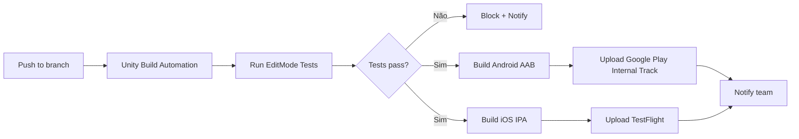

# 15 — Android/iOS Release

## Objetivo e Escopo

Definir pipeline de build, CI/CD, distribuição de testes, processo de publicação em lojas e estratégia de versionamento.

---

## Pipeline de Build

---

## Unity Build Automation

| Configuração | Valor |
|---|---|
| Unity Version | 6.3 LTS (`6000.3.22f1`) |
| Targets | Android (AAB) + iOS (IPA) |
| Scripting Backend | IL2CPP |
| API Level (Android) | 26+ (Android 8.0+) |
| iOS Target | iOS 15.0+ |
| Build Trigger | Push to `release/*` ou `main` branches |
| Tests pre-build | EditMode + PlayMode (critical subset) |
| Artifacts | AAB, IPA, build logs, test reports |

---

## Versionamento

| Componente | Formato | Exemplo |
|---|---|---|
| Semantic Version | MAJOR.MINOR.PATCH | 1.2.3 |
| Build Number | Auto-incremental | 456 |
| Android versionCode | Incremental integer | 456 |
| iOS CFBundleVersion | Incremental string | "456" |
| Bundle Version (display) | MAJOR.MINOR.PATCH | "1.2.3" |

### Regras

- MAJOR: Breaking changes ou nova temporada de conteúdo.
- MINOR: Novos features ou modos.
- PATCH: Bug fixes e ajustes de calibração.
- Build number: nunca decrementa; auto-gerenciado pelo CI.

---

## Distribuição de Testes

| Canal | Plataforma | Audiência | Propósito |
|---|---|---|---|
| Internal Track | Android | Equipe (fundador) | Smoke testing |
| Closed Alpha | Android | Amigos pilotos (10–20) | Feedback de gameplay |
| Closed Beta | Android | Comunidade expandida (100–500) | Estabilidade e métricas |
| Open Beta | Android | Público | Soft launch |
| TestFlight Internal | iOS | Equipe | Smoke testing |
| TestFlight External | iOS | Amigos + comunidade | Beta |

---

## Processo de Publicação

### Android (Google Play)

1. ✅ Criar conta de desenvolvedor Google Play ($25 one-time).
2. ✅ Configurar app listing (título, descrição, screenshots, ícone).
3. ✅ Preencher Data Safety form.
4. ✅ Obter IARC rating.
5. ✅ Configurar IAPs no Play Console.
6. ✅ Upload AAB para Internal Track.
7. ✅ Teste interno → Alpha → Beta → Produção.
8. ✅ Staged rollout (10% → 50% → 100%).

### iOS (App Store)

1. ✅ Apple Developer Program ($99/ano).
2. ✅ Criar App Store Connect listing.
3. ✅ App Privacy (nutrition labels).
4. ✅ Configurar IAPs em App Store Connect.
5. ✅ Submeter para App Review.
6. ✅ TestFlight → Review → Release.
7. ✅ Phased release (1% → 100% em 7 dias).

> 🧑‍💻 Ambos os processos exigem ações humanas do fundador para contas, screenshots e aprovações.

---

## Configurações Técnicas por Plataforma

### Android

| Configuração | Valor |
|---|---|
| Package Name (placeholder de produção; não aprovado) | `br.com.suitedigital.rentalkartworld` |
| Package Name (placeholder de staging; não aprovado) | `br.com.suitedigital.rentalkartworld.staging` |
| Package Name (placeholder de development; não aprovado) | `br.com.suitedigital.rentalkartworld.dev` |
| Min API | 26 (Android 8.0) |
| Target API | 34 (ou mais recente exigida pelo Play) |
| Architecture | arm64-v8a + armeabi-v7a |
| Keystore | Gerenciado via Play App Signing |
| Proguard/R8 | Habilitado (regras customizadas) |

### iOS

| Configuração | Valor |
|---|---|
| Bundle ID (placeholder de produção; não aprovado) | `br.com.suitedigital.rentalkartworld` |
| Bundle ID (placeholder de staging; não aprovado) | `br.com.suitedigital.rentalkartworld.staging` |
| Bundle ID (placeholder de development; não aprovado) | `br.com.suitedigital.rentalkartworld.dev` |
| Deployment Target | iOS 15.0 |
| Architecture | arm64 |
| Bitcode | Disabled (deprecated) |
| Capabilities | In-App Purchase, Push Notifications, Game Center |
| Signing | Automatic via Apple Developer account |

> **Nota (revisão humana M0 em 2026-08-16):** o nome **Rental Kart World** e os identificadores `br.com.suitedigital.rentalkartworld` são placeholders provisórios. Q-RL-01 foi reaberta. Não criar aplicativos definitivos nas lojas nem tratar esses identificadores como aprovados sem nova decisão humana explícita.

---

## Feature Flags e Rollback

| Mecanismo | Uso |
|---|---|
| Remote Config (UGS) | Enable/disable features sem novo build |
| Staged Rollout | Limitar exposição de versão nova |
| Force Update | Exigir atualização se bug crítico |
| Kill Switch | Desabilitar multiplayer se instabilidade |

---

## Requisitos Não Funcionais

| Requisito | Meta |
|---|---|
| Build time (CI) | < 45 min para ambas plataformas |
| Build success rate | > 95% |
| Time to TestFlight | < 2 h após merge em release |
| App size (download) | ≤ 150 MB |
| App Store Review | < 48 h (Apple; não controlável) |

---

## Decisões Confirmadas

1. Unity Build Automation para CI/CD.
2. IL2CPP como scripting backend.
3. Android 8.0+ / iOS 15.0+ como targets mínimos.
4. Play App Signing para Android.
5. Staged rollout para ambas plataformas.
6. Remote Config para feature flags.

## Suposições

| ID | Suposição | Validação |
|---|---|---|
| RL-01 | Unity Build Automation suporta iOS builds sem Mac local | Verificar com Unity |
| RL-02 | AAB ≤ 150 MB é alcançável com Addressables | Medir no milestone 3 |
| RL-03 | App Review Apple aprovará na primeira submissão | Histórico + compliance |

## Questões Abertas

- Q-RL-01: Nome definitivo do pacote/bundle ID?
- Q-RL-02: Screenshots e assets de loja — quem produz? (🧑‍💻)
- Q-RL-03: Localização (pt-BR, en-US) da store listing desde o MVP?
- Q-RL-04: Game Center integration necessária ou apenas Leaderboards internos?

## Links Relacionados

- [ADR Build Pipeline](./adr/0005-build-pipeline.md)
- [Segurança](./14-security-privacy-compliance.md)
- [Estratégia de Testes](./16-test-strategy.md)
