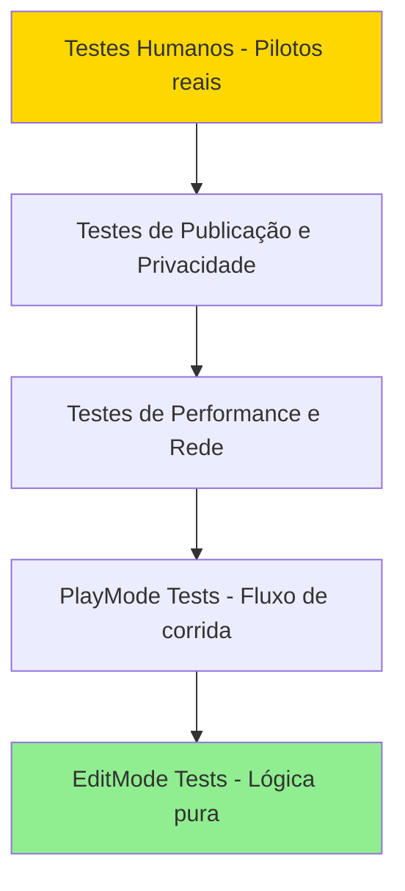

# 16 — Estratégia de Testes

## Objetivo e Escopo

Definir níveis de teste, cobertura, matriz de dispositivos, testes de rede, performance e validação humana com pilotos reais.

---

## Pirâmide de Testes

---

## EditMode Tests (Lógica Pura)

| Área | O que testar | Tipo |
|---|---|---|
| Matemática de física | Cálculos de transferência de peso, aderência | Unit + Property |
| Cálculo de vácuo | Redução de arrasto por distância/tempo | Property |
| Regras de bandeira | Estado de flags por condição | Unit |
| Detecção de penalidade | Lógica de infração | Unit + Property |
| Economia | XP, coins, sink/source | Unit + Property |
| Serialização | Save/load de perfil | **Round-trip Property** |
| Matchmaking scoring | Pontuação de compatibilidade | Property |
| Cálculo de índice limpo | Fórmula do índice | Unit |

### Property-Based Tests Recomendados

| Propriedade | Descrição | Categoria |
|---|---|---|
| Round-trip de serialização | `deserialize(serialize(profile)) == profile` | Round Trip |
| Invariante de economia | `coins >= 0` sempre após transação | Invariant |
| Idempotência de save | Salvar duas vezes = salvar uma vez | Idempotence |
| Metamórfica de vácuo | `arrasto(dist_menor) <= arrasto(dist_maior)` | Metamorphic |
| Invariante de posição | Soma de posições únicas = N pilotos | Invariant |
| Confluência de penalidades | Ordem de aplicação de penalidades não altera total | Confluence |
| Erros de input | Inputs inválidos sinalizam erro apropriado | Error Conditions |

> Parsers e serializadores SEMPRE devem ter teste round-trip (parse → print → parse).

### Execução das propriedades sem FsCheck

- As **34 propriedades obrigatórias do MVP (Properties 1–34)** continuam obrigatórias e devem bloquear o gate do milestone correspondente quando falharem. A Property 35 mantém o tratamento específico de Alpha/Beta documentado no backlog.
- FsCheck não foi incorporado porque sua compatibilidade com o Unity Test Framework, NUnit empacotado e IL2CPP ainda não foi comprovada.
- Até existir uma integração validada, cada propriedade será implementada em NUnit com geradores determinísticos próprios, seed explícita e registrada e **pelo menos 100 casos por propriedade**.
- Toda falha deve informar, no mínimo, a seed e o índice do caso para permitir reprodução exata; quando útil, deve também registrar a entrada minimizada ou serializada.
- FsCheck pode ser reavaliado futuramente mediante pacote aprovado e testes Unity 6.3 LTS (`6000.3.22f1`) + IL2CPP verdes. Essa reavaliação não bloqueia M1.

---

## PlayMode Tests (Integração)

| Cenário | O que validar |
|---|---|
| Fluxo completo de corrida | Quali → grid → corrida → resultado |
| Contagem de voltas | 3 quali + 10 corrida corretas |
| Checkpoints | Ordem correta; anti-corte |
| Bandeiras em cenário | Amarela ativa restringe ultrapassagem |
| Recuperação segura | Reset + imunidade + reintegração |
| Substituição por bot | Desconexão → bot assume |
| Reconexão | Piloto retoma controle |
| Ghost em tomada de tempo | Ghost reproduz volta correta |

---

## Testes de Física Determinísticos

- Mesma seed + inputs → mesmo resultado (dentro de tolerância).
- Tolerância: posição ±0,01 m, velocidade ±0,1 km/h após 1000 ticks.
- Testar cada categoria de kart contra baseline de tempo esperado.
- Regressão: comparar tempos após mudanças de calibração.

---

## Testes de Rede

| Condição | Simulação | Critério de Aceite |
|---|---|---|
| Latência normal | 30–50 ms | Corrida fluida |
| Latência alta | 150 ms | Jogável com interpolação |
| Jitter | ±50 ms | Sem teleporte visível |
| Packet loss | 5% | Sem dessincronização grave |
| Packet loss | 15% | Degradação graciosa; reconexão |
| Desconexão | Drop 10 s | Bot assume; reconexão funciona |
| Host migration | Host sai | Novo host eleito; corrida continua |

Ferramentas: Photon network simulation + Clumsy/Network Link Conditioner.

---

## Testes Anti-Cheat

| Teste | Método |
|---|---|
| Speed hack | Injetar velocidade > máx; verificar rejeição |
| Teleport | Injetar salto de posição; verificar correção |
| Economy tamper | Client tenta incrementar moeda; backend rejeita |
| Result forge | Client envia resultado falso; backend valida |

---

## Testes de Carga

| Cenário | Escala | Critério |
|---|---|---|
| Matchmaking | 100 solicitações simultâneas | < 60 s para match |
| Lobby | 1.000 CCU | Sem degradação |
| Cloud Save | 1.000 writes/s | < 500 ms P95 |
| Leaderboard | 10.000 queries/min | < 200 ms P95 |

---

## Matriz de Dispositivos

### Android (mínimo viável — expandir conforme aquisição)

| Tier | Dispositivo | SoC | RAM | Meta FPS |
|---|---|---|---|---|
| Baixo | TBD (placeholder — ex: Moto G modesto) | Snapdragon 4xx/6xx | 3–4 GB | 30 |
| Médio | Android pessoal do fundador | TBD | TBD | 60 |
| Alto | TBD (placeholder — flagship) | Snapdragon 8xx | 8+ GB | 60 |

### iOS

| Tier | Dispositivo | Meta FPS |
|---|---|---|
| Alto | iPhone 17 disponível (SKU/memória a registrar via `SystemInfo`) | 60 |

> 🧑‍💻 Matriz deve ser expandida conforme o fundador adquire ou consegue acesso a dispositivos. Placeholders devem ser substituídos por modelos reais antes do beta.

---

## Testes de Bateria e Temperatura

| Teste | Duração | Critério |
|---|---|---|
| Drain de bateria | 30 min de corrida | < 15% em dispositivo médio (hipótese) |
| Temperatura | 30 min contínuos | < 42°C (hipótese) |
| Throttling térmico | 45 min | FPS não cai abaixo do mínimo do tier |

---

## Testes de Compras

| Cenário | Validação |
|---|---|
| Compra bem-sucedida | Item concedido + receipt validado |
| Compra cancelada | Sem cobrança, sem item |
| Compra com receipt inválido | Rejeitada, logada |
| Restauração | Itens restaurados corretamente |
| Falha de rede durante compra | Retry + reconciliação |
| Compra duplicada | Idempotência (não conceder 2x) |

---

## Testes de Acessibilidade

| Teste | Validação |
|---|---|
| Modo canhoto | Layout espelhado funcional |
| Alto contraste | Contraste ≥ 4.5:1 |
| Daltonismo | Bandeiras distinguíveis por forma + cor |
| Redução de movimento | Efeitos reduzidos |
| Escalabilidade de texto | Legível em todos os tamanhos |
| Háptica off | Jogo jogável sem vibração |

> Validação completa de acessibilidade requer testes com assistive technologies e revisão de especialista.

---

## Testes de Publicação e Privacidade

| Teste | Validação |
|---|---|
| Consentimento LGPD/GDPR | Popup aparece e respeita escolha |
| Opt-out de analytics | Eventos param após opt-out |
| Exclusão de dados | Fluxo completo funciona |
| Data Safety (Play) | Declaração corresponde à coleta real |
| Privacy Labels (Apple) | Labels correspondem à coleta real |

---

## Sessões com Pilotos Reais

- Amigos pilotos do campeonato do fundador como testadores primários.
- Roteiro: escola → treino livre → corrida contra bots → multiplayer privado.
- Coletar: NPS, feedback qualitativo de dirigibilidade, comparação com kart real.
- Meta: NPS ≥ 50 antes do soft launch.
- Iterar calibração de física com base no feedback.

---

## Definição de "Done" (Testes)

Uma história está pronta quando:

1. Critérios de aceite (Given/When/Then) passam.
2. Testes automatizados aplicáveis escritos e verdes.
3. Sem regressão em suite existente.
4. Performance dentro do budget.
5. Diff revisado.
6. Documentação afetada atualizada.

---

## Decisões Confirmadas

1. Property-based testing para lógica pura, economia e serialização.
2. Round-trip obrigatório para save/load.
3. Testes de física determinísticos com tolerância.
4. Sessões humanas com pilotos reais obrigatórias antes do soft launch.
5. Matriz de dispositivos com placeholders até aquisição.

## Suposições

| ID | Suposição | Validação |
|---|---|---|
| TS-01 | Física é determinística o suficiente para testes com tolerância | Validar no milestone 2 |
| TS-02 | Amigos pilotos disponíveis para testes regulares | Confirmar com fundador |
| TS-03 | Ferramentas de simulação de rede refletem condições reais BR | Comparar com testes de campo |

## Questões Abertas

- Q-TS-01: Quais dispositivos exatos compõem a matriz? (🧑‍💻 aquisição)
- Q-TS-02: Automatizar testes de performance em device farm (Firebase Test Lab)?
- Q-TS-03: Frequência de sessões com pilotos reais?

## Links Relacionados

- [Física](./04-driving-physics.md)
- [Multiplayer](./08-multiplayer-architecture.md)
- [Performance](./12-art-audio-performance.md)
- [Backlog](./18-product-backlog.md)
