# 17 — Roadmap

## Objetivo e Escopo

Definir milestones com dependências, critérios de saída e estimativas de esforço. As estimativas diferenciam horas de agente de IA, horas humanas e tempo de calendário, considerando um fundador não-desenvolvedor com 8–12 h/semana.

---

## Premissas de Estimativa

- **Horas de agente**: Trabalho executado por Codex/agentes de IA (código, testes, docs).
- **Horas humanas**: Validação, decisões, testes físicos, assets, contas de loja (fundador).
- **Tempo de calendário**: Duração real considerando disponibilidade de 8–12 h/semana humanas.
- Três cenários: **Otimista**, **Base**, **Pessimista**.

---

## Milestones

### M1 — Preprodução e Riscos

**Objetivo:** Documentação completa, ADRs, setup de repositório e ferramentas.

**Critério de saída:** Todos os docs aprovados; ADRs decididos; repo + CI configurados; questões bloqueantes resolvidas.

| Cenário | Horas Agente | Horas Humanas | Calendário |
|---|---|---|---|
| Otimista | 20 | 15 | 2 semanas |
| Base | 30 | 25 | 3 semanas |
| Pessimista | 40 | 40 | 5 semanas |

---

### M2 — Kart Dirigível em Pista Cinza

**Objetivo:** Um kart controlável com física simcade básica em pista de teste sem arte.

**Dependências:** M1, ADR-0001 (engine), ADR-0004 (rendering).

**Critério de saída:** Kart acelera, freia, curva com transferência de peso; 30 FPS em dispositivo modesto; parâmetros em ScriptableObject.

| Cenário | Horas Agente | Horas Humanas | Calendário |
|---|---|---|---|
| Otimista | 60 | 20 | 4 semanas |
| Base | 90 | 35 | 6 semanas |
| Pessimista | 130 | 55 | 9 semanas |

---

### M3 — Vertical Slice Offline

**Objetivo:** Uma pista jogável com arte, tomada de tempo e corrida offline (sem bots).

**Dependências:** M2.

**Critério de saída:** 1 pista fictícia com arte; tomada de tempo 3 voltas + ghost; corrida 10 voltas solo; bandeiras verde/quadriculada; budget de performance respeitado.

| Cenário | Horas Agente | Horas Humanas | Calendário |
|---|---|---|---|
| Otimista | 80 | 30 | 5 semanas |
| Base | 120 | 50 | 8 semanas |
| Pessimista | 170 | 75 | 12 semanas |

---

### M4 — Corrida Contra Bots

**Objetivo:** Bots com 5 perfis correndo de forma justa.

**Dependências:** M3, ADR-0006 (regras).

**Critério de saída:** Até 9 bots; respeitam bandeiras e limites; erros humanos parametrizados; recuperação segura; penalidades básicas.

| Cenário | Horas Agente | Horas Humanas | Calendário |
|---|---|---|---|
| Otimista | 70 | 25 | 4 semanas |
| Base | 110 | 40 | 7 semanas |
| Pessimista | 150 | 60 | 10 semanas |

---

### M5 — Multiplayer Privado

**Objetivo:** Salas privadas online com código, até 4 humanos + bots.

**Dependências:** M4, ADR-0002 (networking), ADR-0003 (backend).

**Critério de saída:** Sala por código; sincronização a 30 Hz; reconexão; substituição por bot; resultados validados no backend.

| Cenário | Horas Agente | Horas Humanas | Calendário |
|---|---|---|---|
| Otimista | 100 | 35 | 6 semanas |
| Base | 160 | 55 | 10 semanas |
| Pessimista | 220 | 85 | 15 semanas |

---

### M6 — Escola e Licenças

**Objetivo:** Currículo de 10 módulos + sistema de licenças.

**Dependências:** M3.

**Critério de saída:** 10 módulos funcionais; linha ideal progressiva; feedback por setor; prova de licença; concessão de licença.

| Cenário | Horas Agente | Horas Humanas | Calendário |
|---|---|---|---|
| Otimista | 70 | 30 | 5 semanas |
| Base | 110 | 45 | 8 semanas |
| Pessimista | 150 | 70 | 11 semanas |

---

### M7 — Perfil, Garagem e Ranking

**Objetivo:** Perfil de piloto, garagem com cosméticos, leaderboards.

**Dependências:** M5.

**Critério de saída:** Perfil com stats/licenças/índice; garagem funcional; cosméticos equipáveis; ranking de melhor volta; campeonato privado.

| Cenário | Horas Agente | Horas Humanas | Calendário |
|---|---|---|---|
| Otimista | 60 | 25 | 4 semanas |
| Base | 90 | 40 | 6 semanas |
| Pessimista | 130 | 60 | 9 semanas |

---

### M8 — Alpha com Amigos do Campeonato Real

**Objetivo:** Build testável com pilotos reais; iteração de física.

**Dependências:** M6, M7.

**Critério de saída:** Build estável distribuída; NPS ≥ 40; física calibrada com feedback; crash rate < 2%.

| Cenário | Horas Agente | Horas Humanas | Calendário |
|---|---|---|---|
| Otimista | 50 | 40 | 4 semanas |
| Base | 80 | 65 | 7 semanas |
| Pessimista | 120 | 100 | 11 semanas |

---

### M9 — Beta Android e TestFlight

**Objetivo:** Distribuição ampliada; monetização básica; telemetria completa.

**Dependências:** M8.

**Critério de saída:** IAP funcional; ads integrados; telemetria completa; crash rate < 1%; 100–500 testadores; contas de loja configuradas.

| Cenário | Horas Agente | Horas Humanas | Calendário |
|---|---|---|---|
| Otimista | 60 | 45 | 5 semanas |
| Base | 100 | 70 | 8 semanas |
| Pessimista | 150 | 110 | 13 semanas |

---

### M10 — Soft Launch

**Objetivo:** Lançamento regional limitado; validação de métricas.

**Dependências:** M9.

**Critério de saída:** Publicado em região limitada; D1 ≥ 40%; ARPDAU medido; economia estável; infra suporta 1.000 CCU.

| Cenário | Horas Agente | Horas Humanas | Calendário |
|---|---|---|---|
| Otimista | 40 | 40 | 4 semanas |
| Base | 70 | 60 | 7 semanas |
| Pessimista | 110 | 90 | 11 semanas |

---

### M11 — Lançamento e LiveOps

**Objetivo:** Lançamento global; operação contínua; temporadas.

**Dependências:** M10.

**Critério de saída:** Publicado globalmente; pipeline de LiveOps; primeira temporada; ranked ativado via flag; suporte estabelecido.

| Cenário | Horas Agente | Horas Humanas | Calendário |
|---|---|---|---|
| Otimista | 50 | 50 | 5 semanas |
| Base | 90 | 80 | 9 semanas |
| Pessimista | 140 | 120 | 14 semanas |

---

## Resumo de Calendário (Base)

```mermaid
gantt
    title Roadmap Base (semanas cumulativas)
    dateFormat X
    axisFormat %s
    section Preprodução
    M1 Preprodução        :0, 3
    section Protótipo
    M2 Kart dirigível     :3, 6
    M3 Vertical slice     :9, 8
    section Gameplay
    M4 Bots               :17, 7
    M6 Escola             :17, 8
    M5 Multiplayer        :24, 10
    M7 Perfil/Garagem     :34, 6
    section Validação
    M8 Alpha              :40, 7
    M9 Beta               :47, 8
    M10 Soft Launch       :55, 7
    M11 Lançamento        :62, 9
    section Pós-MVP
    M12 Real Track Partner Platform :71, 16
```

> ⚠️ Total base: ~71 semanas (~16 meses) de calendário considerando 8–12 h/semana humanas. M4 e M6 podem paralelizar parcialmente. Otimista: ~50 semanas. Pessimista: ~100 semanas.

---

## Pós-MVP — Plataforma de Parceiros de Pistas Reais (Real Track Partner Platform)

**Objetivo:** Permitir que kartódromos reais (iniciando em Brasília, depois outros estados/países) tenham versões oficiais de suas pistas no jogo via parceria/autorização.

**Milestone:** M12+ (Pós-MVP)

**Escopo previsto (sem implementação no MVP):**

| Área | Descrição |
|---|---|
| Cadastro de parceiro | Registro de kartódromo parceiro com dados legais |
| Licenciamento | Nome, marca, layout, imagens, patrocinadores |
| Captura de dados | Fotos autorizadas, vídeos onboard, imagens 360, plantas, medições, GPS, drone |
| Pipeline de modelagem | Fotogrametria e modelagem 3D a partir dos dados capturados |
| Otimização mobile | Processamento de cena para atingir budgets mobile |
| Validação de layout | Pilotos locais validam fidelidade do traçado |
| Aprovação do parceiro | Aprovação final antes de publicação |
| Distribuição | Download via Addressables (sob demanda) |
| Packs regionais | Agrupamento de pistas por região/estado |
| Rankings por pista | Leaderboards específicos da pista real |
| Campeonatos | Campeonatos virtuais e presenciais vinculados |
| Desafios de tempos reais | Comparar tempos virtuais com tempos reais de referência |
| Booking | Links para agendamento de sessões no kartódromo real |
| Patrocínios virtuais | Placas e banners in-game correspondentes ao real |
| Telemetria comercial | Dados agregados de uso para o parceiro |
| Revenue sharing | Modelo de compartilhamento de receita a definir |

**Restrições:**
- **NUNCA** usar nome, logo, fotografia, imagem de satélite, pintura, publicidade ou réplica exata de pista real sem autorização formal.
- MVP usa exclusivamente pista fictícia.

**Estimativa preliminar (Base):**

| Cenário | Horas Agente | Horas Humanas | Calendário |
|---|---|---|---|
| Otimista | 200 | 100 | 12 semanas |
| Base | 350 | 160 | 16 semanas |
| Pessimista | 500 | 250 | 24 semanas |

> Requer validação jurídica, contratos de parceria e pipeline de arte que envolvem ações humanas significativas (🧑‍💻).

---

## Riscos de Cronograma

| Risco | Impacto | Mitigação |
|---|---|---|
| Calibração de física demora | +4–8 semanas | Iteração contínua desde M2 |
| Disponibilidade do fundador cai | Atraso proporcional | Priorizar decisões bloqueantes |
| Multiplayer mais complexo que estimado | +4–6 semanas | Começar simples (host authority) |
| App Review rejeições | +2–4 semanas | Compliance desde o início |

---

## Decisões Confirmadas

1. 11 milestones sequenciais com paralelização parcial (M4/M6).
2. MVP = M1 a M9; validação em M8–M10.
3. Estimativas em 3 cenários.
4. Física calibrada iterativamente desde M2.

## Suposições

| ID | Suposição | Validação |
|---|---|---|
| RM-01 | Fundador mantém 8–12 h/semana consistentes | Revisão mensal de progresso |
| RM-02 | Codex acelera desenvolvimento em ~3x vs manual | Medir velocity após M2 |
| RM-03 | M4 e M6 podem paralelizar | Confirmar dependências no planejamento |

## Questões Abertas

- Q-RM-01: Contratar ajuda humana pontual (arte, áudio)? Orçamento?
- Q-RM-02: Soft launch em qual região primeiro (Brasil)?
- Q-RM-03: Ranked entra no MVP ou fica estritamente pós-lançamento?

## Links Relacionados

- [Backlog](./18-product-backlog.md)
- [Riscos](./19-risk-register.md)
- [GDD](./02-game-design-document.md)
